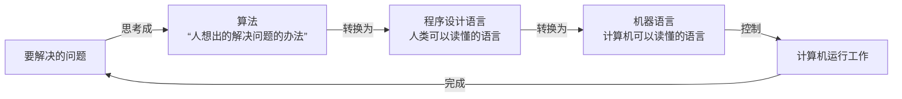
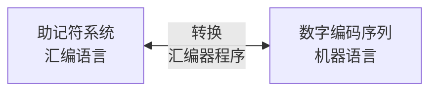
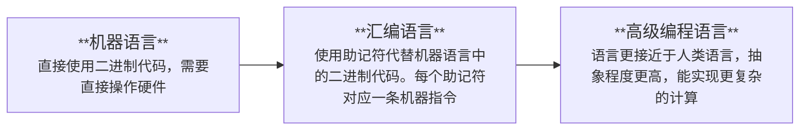
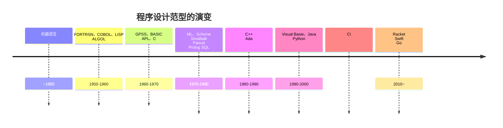
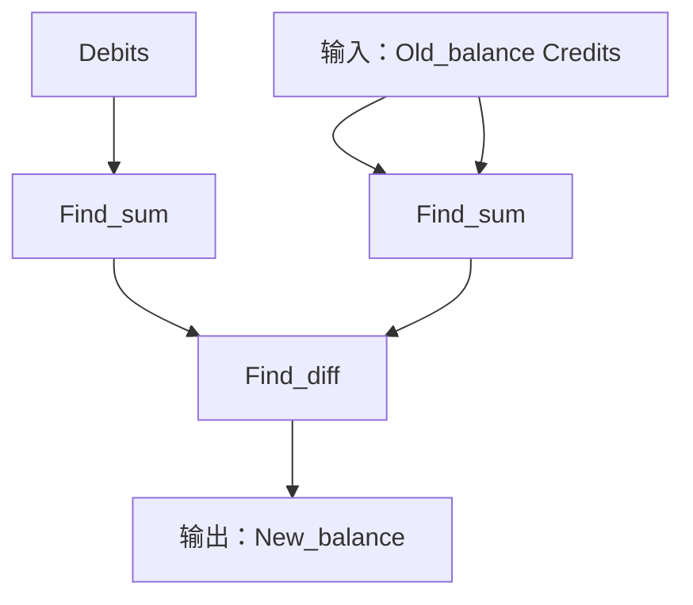

# 第 6 章  程序设计语言

本章主要是了解程序设计语言及其相关联的方法之间的共性和个性。

人们开发出许多程序设计语言，使得算法的表达既便于人理解，又便于转换为机器语言语言指令。




## 6.1  历史回顾

追溯程序设计语言的历史进程。

### 6.1.1  早期程序设计语言

现代计算机的程序有采用数字编码的指令序列组成。这样的编码系统称为**机器语言**。但是，用机器语言编写程序是一项烦琐的任务，而且经常出错。

为了简化程序设计过程开发了**计数制系统**，使得指令可以用**助记符**表示，而不用使用数字形式表示。

> 计数制系统（Number System）：是数学和计算机科学中用于表示数值的一种方法。不同的计数制系统使用不同的基数（Base）来定义数值的表示方式。
>
> 在计算中，常用的计数制系统有二进制、十进制、十六进制等。例如：
>
> > 十进制（Decimal System/ˈdes.ɪ.məl ˌsɪs.təm/）：基数为 10；数字符号0～9；它是日常生活中最常用的计数制系统。每位数字的值是 10 的幂次的倍数。比如：数字 “345”在十进制中表示为：3x10<sup>2</sup>+4x10<sup>1</sup>+5x10<sup>0</sup>。
>
> > 二进制（Binary System）：基数为 2；数字符号：0,1；它是计算机科学中最基本的计数制系统，因为计算机使用二进制位（bits）来处理数据。比如：十进制数“345”在二进制中的表示为“101011001”，即 1x2<sup>8</sup>+0x2<sup>7</sup>+1x2<sup>6</sup>+0x2<sup>5</sup>+1x2<sup>4</sup>+1x2<sup>3</sup>+0x2<sup>2</sup>+0x2<sup>1</sup>+1x2<sup>0</sup>=345。
>
> > 八进制（Octal /ˈɒk.təl/ System）：基数 为 8；数字符号：0～7；在计算机科学中有时用作二进制的简写，因为每个八进制为对应三个二进制位。比如十进制数“345”在二进制中表示为“101011001”，在八进制中表示为“531”，即 5x8<sup>2</sup>+3x8<sup>1</sup>+1x8<sup>0</sup>=531。
>
> > 十六进制（Hexadecimal /ˌhek.səˈdes.ɪ.məl/ System）：基数为 16；数字符号为0～9，A，B，C，D，E，F（A-F 表示 10-15）；它常用于计算机编程，尤其是在表示内存地址和颜色代码时，因为它紧凑且易于与二进制互换。比如十进制数“345”在二进制中表示为“101011001”，在十六进制中表示为“159”，即 1x16<sup>2</sup>+5x16<sup>1</sup>+9x16<sup>0</sup>。
>
> 计数制系统是表示数值的基础，对于不同的应用场合，使用合适的计数制系统可以简化计算和数据处理。计算机科学领域中，二进制和十六进制尤为重要，因为它们直接关系到计算机系统的设计和数据表示。掌握不同的计数制系统的概念和转换方法，是学习计算机科学的关键一步。

> 助记符（Mnemonic /nɪˈmɒn.ɪk/）：在计算机科学中，助记符通常指代一种简化的文本符号，旨在帮助人们更容易记忆和理解复杂的机器语言指令。助记符广泛用于汇编语言中，它们为机器代码提供了一种更人性化的表示，使程序员更容易编写和阅读低级代码。
>
> > 助记符使用简短的字母组合来表示复杂的机器指令。例如，`ADD`可能用于表示加法指令，而`MOV`用于传输数据指令。由于助记符是人类可读的文本，相对于机器码更容易理解和记忆，因此，助记符大大提高了代码的可读性，便于程序员调试和维护。例如：指令`把寄存器 5 的内容移到寄存器 6`可用机器语言表示为`0x4056`而使用助记符系统时，可以表示为`mov R5, R6`。

建立起助记符系统后，人们就开发了称为**汇编器**（assembler /əˈsem.blər/）的程序，用来将助记符表达式转换为机器语言指令。以此方式，人们可以使用助记符的形式开发程序，然后再用汇编器程序把助记符程序转换为机器语言。



表示程序的助记符系统统称为**汇编语言**（assembly language）。用汇编语言写的程序本质上是依赖于机器的，也就是说，程序中的指令都是遵循特定的机器特性来表达的。<br>反过来，用汇编语言写的程序不能被简单地移植到另一种机器设计上，因为这个程序必须重写才能遵循新计算机的寄存器配置和指令集。汇编语言的另一个缺点是，尽管程序员不再必须使用数字形式对指令进行编码，但仍不得不从机器语言的角度一小步一小步地思考。

简而言之，构建产品最终要用的基本原语不一定是在产品设计过程中使用的原语。这个设计过程应该更适合使用高级原语，每一个原语都代表一个与产品设计特性相关的概念。一旦设计过程结束，这些原语就能够被翻译成与现实细节相关的较低层次的概念。

第三代程序设计语言的方法是标识一组高级原语，每一个原语都要能够实现为一个机器语言可用的低级原语序列。第三代程序设计语言与前两代程序设计语言不同之处在于，它们的原语不仅级别更高而且都是与**机器无关**的，因为它们不依赖于特定机器的特性。

例如，语句`assign TotalCost the value Price + ShippingCharge`表达了一个高级活动，不涉及特定机器应该如何完成这项任务，但它可以由先前讨论过的机器指令序列来实现。因此，我们的伪代码结构`标识符 = 表达式`是潜在的高级原语。

> 标识符（Identifier /aɪˈden.tɪ.faɪ.ər/）：是编程语言中用于命名变量、函数、类、模块以及其他用户自定义实体的名称。标识符的主要作用是为代码中的不同元素提供一个可识别的符号，以便在程序中引用和使用这些元素。
>
> 表达式（Expression /ɪkˈspreʃ.ən/）：是编程语言中用来计算出某个值的组合。表达式可以包含变量、常量、运算符、函数调用等，它们按照某种规则组合在一起，实现特定的计算。

一旦确定了这组高级原语，就可以编写称作**翻译器**（translator）或**编译器**（compiler /kəmˈpaɪ.lər/）的程序，这个程序能够把用高级原语表示的程序翻译成机器语言程序。翻译器的一种替代方案是**解释器**（interpreter/ɪnˈtɜː.prə.tər/），它在翻译出指令的同时执行指令，而不是把翻译出的指令记录下来供将来使用。<br>也就是说，解释器不产生供以后执行使用的机器语言副本，而是依据程序的高级形式实际执行它。


程序设计语言演变发展的三个阶段：



### 6.1.2  机器无关和超越机器无关

随着第三代程序设计语言的开发，机器无关的目标基本实现了。软件可以从一台机器相对容易地移植到另一台机器。并且，机器无关的目标已经被证明是更高要求目标的基础。

反过来，计算机科学家们梦想实现这样的程序设计环境：它允许人们用抽象的概念与机器进行交互，而不是强迫机器把这些概念翻译成与机器兼容的格式。此外，计算机科学家希望机器能够完成许多算法发现过程，而不是只能完成算法执行。

----

**基本知识点**

* 高级程序设计语言为程序员提供了更多的抽象，使人们读写程序更容易。

------

### 6.1.3  程序设计范型

> 程序设计范型：是指用于构建计算机程序的一种编程风格或方法论。它提供了一种思考和组织代码的框架。不同的编程范型强调不同编程概念和结构，适用于不同类型的问题和需要。了解各种编程范型可以帮助程序员选择最合适的工具和方法来解决特定问题。
>
> 许多现代编程语言是多范型的，意味着它们支持多种编程范型，从而给予程序员灵活性。例如，Python 既支持面向对象编程，也支持函数式编程和命令式编程。这种灵活性使得程序员可以根据具体问题选择最合适的范型或将多种范型结合使用。
>
> 理解不同的编程范型有助于程序员更好地选择和使用适合某个特定任务的编程方法。随着编程语言的发展，混合使用多种范型的能力将变得越来越重要，使得程序员能够以更高效和更具创造性的方式解决复杂问题。



---

**基本知识点**

* 不同层次的程序设计语言提供不同层次的抽象。
* 用于算法的语言包括自然语言、伪代码，以及可视和文本程序设计语言。
* 不同的语言更适合表达不同的算法。
* 一些程序设计语言是为特定领域设计的，更适合表达那些领域中的算法。
* 用于表达算法的语言可能会影响清晰度或可读性之类的特性，但不会影响算法解决方案是否存在。
* 几乎所有的程序设计语言都能够表达任何算法。
* 在用语言表达算法时，清晰度和可读性时最重要的考虑因素。

----

**命令式范型**（imperative paradigm /ɪmˈperətɪv ˈpærədaɪm/）也叫**过程范型**（procedural paradigm /prəˈsiːdʒərəl ˈpærədaɪm/），它定义的程序设计过程是开发一个命令序列，遵照这个序列，对数据进行操作以产生所期望的结果。<br>也就是说，要处理程序设计过程，首先要找到解决手头问题的算法，然后将这个算法表示为一个命令序列。

**说明性范型**（declarative paradigm/dɪˌklær.ə.tɪv ˈpær.ə.daɪm/）：是应用预先设定的解决问题的通用算法来解决面临的问题。它要求的是程序员描述要解决的问题，而不是要遵循的算法。在这种环境下，程序员的任务是准确描述要解决的问题，而不是开发解决问题的算法。

要理解**函数范型**（function paradigm）首先要理解**函数**（function），它是指接受输入和产生输出的实体。<br>函数范型是指程序是通过连接较小的预定义函数（预定义程序单元）来构建的，其中每个预定义函数的输出用作下一个预定义函数的输入，通过这种方式可以获得所期望的整体上的输入-输出关系。<br>简而言之，在这种函数式范型下程序设计过程就是把函数构造成较简单的函数的嵌套联合体。



上图说明了如何由两个简单的函数构成一个计算支票簿余额的函数。其中：

* 一个称为`Find_sum`，它接收一些值作为输入，产生这些值的和作为输出；
* 另一个称为`Find_diff`，它接收两个输入值，计算它们的差。

使用 著名的函数式设计语言LISP可以顺带下列表达式表示：

```Lisp
(Find_diff (Find_sum Old_balance Credits) (Find_sum Debits))
```

该表达式的这个嵌套结构（如括号中指定的）反映了这样一个事实：函数`Find_diff`的输入是由`Find_sum`的两次应用产生的：

* `Find_sum`的第一次应用是产生所有`Credits`加`Old_balance`的结果；
* `Find_sum`第二次应用是计算所有`Debits`的总和。
* 函数`Find_diff`使用这两个结果计算新的支票余额。

为了更全面地理解函数式范型与命令式范型的区别，我们把支票簿余额的函数式程序同下面遵循命令式范型的伪代码程序进行一下比较：

```python
Total_crdeits = 所有 Credits 的总和
Temp_balance = Old_balance + Total_credits
Total_debites = 所有 Debits的总和
Balance = Temp_balance - Total_debits
```

这个命令式程序由多条语句组成，每条语句都请求执行计算，并请求把这个结果存储起来供以后使用。与命令式程序不同，函数式程序由单条语句构成，程序中的每个计算结果都会立即传送给下一个函数式程序。

从某种意义上说，命令式程序可以看作若干工厂的集合，这些工厂中每家工厂都把原材料生产成产品，把这些产品存放在仓库里；然后产品从这些仓库被装运到其他需要这些产品的工厂。<br>虽然函数式程序也可以看作若干协调工作的工厂的集合，但是这些工厂仅生产其他工厂订购的产品，然后立刻把这些产品运送到目的地而不需要中间存储。这种效率也是函数式范型的支持者宣称的优点之一。

**面向对象范型**（object-oriented/ˈɒbdʒɪkt ɔːrientɪd/ paradigm）：是与称为**面向对象程序设计**（object-oriented programming，OOP）的程序设计过程相关联的。遵照该范型设计的软件系统被看作称为**对象**（object）的单元的集合，其中每个对象都能够执行与自己直接相关的动作以及其他对象请求的动作。总之，这些对象相互作用共同解决手头的问题。