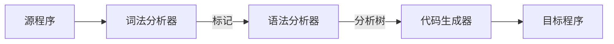
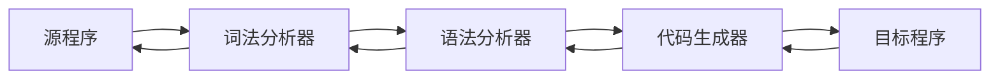

## 6.4  语言实现

把高级语言编写的程序转换为机器可执行形式的过程。

### 6.4.1  翻译过程

**翻译**（translation）将程序从一种语言转换成另一种语言的过程。

**源程序**（source program）是指原始形式的程序。

**目标程序**（object program）是指翻译后的源程序版本。

翻译过程包括 3 个活动，它们分别是词法分析、语法分析和代码生成，翻译器中完成这3 个活动的相应单元分别称为**词法分析器**（lexical/ˈlek.sɪ.kəl/ analyzer/ˈæn.əl.aɪ.zər/）、**语法分析器**（parser/ˈpɑːzə/）和**代码生成器**（code generator）。

**词法分析**是指识别源程序（原始形式的程序）中构成**标记**（token，单个实体的字符串）的过程。 因此，词法分析器逐个符号地读源程序，识别出哪些符号的组合代表一个标记，然后根据这些标记是否是数值、单词、算数运算符等对这些标记分类。词法分析器对每一个标记及其分类进行编码，并将它们提交给语法分析器。在此过程中，词法分析器会跳过所有的注释语句。

**语法分析器**将程序看作是由**标记**（词法单元）组成的，而不是独立符号组成的。语法分析器的工作就是将这些标记（词法单元）组合成语句。 实际上，语法分析是标识程序中的语法结构和辨认每个成分作用的过程。
一个程序的语法分析过程本质上就是为源程序构建语法分析树的过程。

**代码生成**（code generation）是指构造机器语言指令来实现语法分析器能识别的语句的过程。 **代码优化**（code optimization/ˌɒp.tɪ.maɪˈzeɪ.ʃən/）是代码生成器的重要任务。

----

**基本知识点**

* 用程序设计语言编写的代码经常会被翻译成另一种（较低级的）语言的代码，以便在计算机上执行。

----

词法分析、语法分析和代码生成这 3 个活动并不是严格按照顺序执行的。相反，这些活动是交织在一起的。 词法分析器首先从源程序中读取字符，并且标识出第一个标记。然后，词法分析器将这个标记传递给语法分析器。每当语法分析器从词法分析器接收到一个标记时，就开始分析正在读取的文法结构。此时，它可能会向词法分析器请求另一个标记，而如果语法分析器认为已经读到了一个完整的短语或者语句，它就会请求代码生成器产生相应的机器指令。每一个这样的请求都会使代码生成器生成机器指令，并且将其加入目标程序中。 接着，将一个程序从一种语言翻译成另一种语言的任务自然符合面向对象范型。源程序、词法分析器、语法分析器、代码生成器以及目标程序都是对象，每一个对象都在完成自己的任务的同时通过来回发送消息与其他对象进行交互。

### 6.4.2  软件开发包

像编辑器和翻译器这样的在软件开发过程中应用的软件工具，通常会组合成一个包。起到集成软件开发系统的作用。通过使用该应用包，程序员可以随时使用编辑器编写程序，使用翻译器将程序转换成机器语言，使用各种各样的调试工具来跟踪故障程序的执行，以发现哪里出现了问题。

这样的集成系统最大的好处就是程序员在面对需要修改和测试的程序时，可以很容易地在编辑器与测试工具之间来回切换。

从小范围讲，软件开发包中的编辑器通常根据正在使用的程序设计语言进行定制。这样的编辑器通常会提供自动的行缩进功能，这已成为目标语言的事实标准，在某些情况下，程序员键入前面几个字符之后，编辑器就能够识别并自动补全关键字。此外，编辑器和已突出显示源程序中的关键字（也许是使用颜色），使程序更易读。