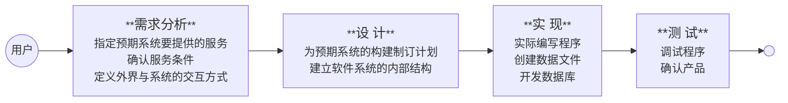

# 第 7 章  软件工程

本章讨论的是在开发大型的复杂软件过程中遇到的问题。本章的主题之所以称为*软件工程*，是因为软件开发是一个工程化的过程。研究软件工程的目标就是要找到一些原则来指导软件开发过程，进而生产出高效可靠的软件产品。

---

**持久理解**

**开发程序可以用于创造性地表达、满足个人好奇心、创造新知识或解决问题（以帮助人们、组织或社会）**。

**人们出于不同的目的开发、维护和使用程序**。

**软件工程是与构建满足用户需求的可靠软件系统有关的知识体（系）**。

***

软件工程是计算机科学的一个分支，致力于寻找指导大型复杂软件系统的开发原则。开发这类系统所面对的问题并非只是编写小程序所面对问题的放大。

## 7.1  软件工程科学

现在的软件工程研究在两个层面上进行：

* 一部分研究者（有时也称为实践派）的工作指向开发直接应用的技术。
  * 实践派以前开发和提出的许多方法已经被其他方法代替；
  * 新方法本身可能也将随着时间的推移而被淘汰。
* 另一部分研究者（称为理论派）则致力于探寻软件工程的基础原理和理论，为将来构建更稳定的技术而努力。
  * 理论派的进展一直很缓慢。

实践派和理论派这两方面进展的需求都是巨大的。我们这个社会已经沉迷于计算机系统及其相关软件。

**基本知识点**

* 协作可以减小单个程序员需要完成的任务的大小和复杂度。
* 程序迭代开发中的协作需要与单独开发程序不同的技能。
* 开发程序时的成功协作需要参与者之间的有效沟通。

## 7.2  软件生命周期

软件工程最基础的概念是软件生命周期。

> 软件生命周期：是指软件从需求分析、设计、开发、测试、部署到维护和退役的全过程。

### 7.2.1  周期是个整体

上图展示的是软件生命周期，它表面了一个事实，即软件一旦开发完成，就进入了一个使用和维护的周期，这个周期将一直持续到软件生命结束。 软件进入维护阶段是因为发现了错误，软件应用中发生的变化需要在软件中做响应的修改，或者上一次修改中的变更导致软件中其他地方出现了问题。

### 7.2.2  传统的开发阶段

传统的软件开发生命周期的主要步骤是需求分析、设计、实现和测试。

1. 需求分析

   * 需求分析的目标是：指定预期系统要提供的服务，确认这些服务的条件；定义外界与系统的交互方式。
   * 需求分析的过程包括：收集和分析软件用户的需求；和项目的**利益相关者**（stakeholder ）协商，在一般需求、核心需求、费用和可行性之间权衡；最终确定的需求要明确最终的软件系统必须具有的特性和服务。 这些需求被记录在一个称为**软件需求规格说明**（software requirements specification）的文档中。
     * **利益相关者**（stakeholder /ˈsteɪkˌhəʊl.dər/），将来的使用者，还有其他有关联的人，如法律上或者财务上相关的人。
     * **软件需求规格说明**（software requirements specification）文档是指涉及个发之间达成的书面协议，目的是指导软件开发，为日后开发过程中可能产生的分歧提供解决方法。

2. 设计

   设计主要是为预期系统的构建制订计划。

   软件系统的内部结构是在设计阶段建立的。

3. 实现

   实现涉及程序的实际编写、数据文件的创建和数据库的开发。

4. 测试

   在过去传统的开发阶段中，测试本质上等同于调试程序和确认最终的软件产品是否与软件需求规格说明文档相一致的过程。

遗憾的是，尽管有现代的质量保障技术，大型软件系统还是会有错误，即是经过大量的测试也不能避免。其中许多错误可能在软件的生命周期内都检测不出来，当时另一些错误却可能会造成重大的故障。消除这种错误是软件工程的目标之一。错误仍然普遍存在的事实意味着还有许多研究要做。