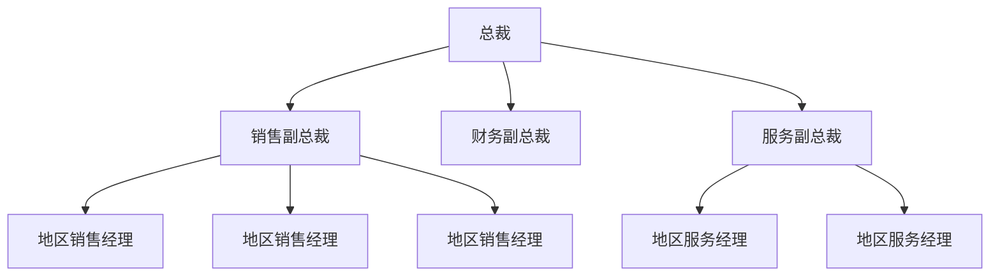

# 第 8 章  数据抽象

本章研究的是称为数据结构的学科，即如何对数据排列进行模拟，让数据的使用者将数据集视为一种抽象工具来访问，而不是强迫用户从计算机的主存储器组织的角度去思考。

## 8.1  基本数据结构

> 数据结构：指的是在计算机内存中组织和存储数据的方式。不同的数据结构适用于不同类型的任务和问题，选择合适的数据结构可以显著提高程序的效率和性能。

### 8.1.1  数组和聚合

**数组**（array/əˈreɪ/）：是一种“矩形的”数据块，它的每一项具有相同的数据类型。

**聚合类型**（aggregate/ˈæɡ.rɪ.ɡət/ type）：是一个由数据项组成的块，其中的各个数据项可能具有不同的类型和大小。块里各个数据项通常称为**字段**（field）。

### 8.1.2  列表、栈和队列

**列表**（list）：它是一个集合，其表项按顺序排列。 列表的开头称为**表头**（head），列表的结尾称为**标尾**（tail/teɪl/）。

通过严格限制列表中项的访问方式，我们可以得到两种特殊类型的列表——栈和队列。

* **栈**（stack/stæk/，码放整齐的堆、叠、摞）：是一种列表，其项只能在表头进行添加和删除。注意，最后放入栈中的项总是被最先移除，因此我们说栈是一种**后进先出**（Last-In, First-Out, LIFO）的结构。
  * 栈的头称为栈顶（top），在栈顶添加一个新项称为**入栈**（pushing /ˈpʊʃɪŋ/）；在栈顶删除一个项称为**出栈**（popping /ˈpɒp.ɪŋ/，突然或匆匆地去）
  *  栈的尾称为栈底（bottom 或 base）。
  * 栈常常被用作**回溯**活动的基本结构。 **回溯**（backtracking）是指退出系统的过程，它与进入系统的顺序相反。
* **队列**（queue /kjuː/）：是一种列表，其项只能从表头移除，新项只能从表尾插入。
  * 队列是一种**先进先出**（first-in, first-out, FIFO）结构，这意味着表项是按其存储的顺序从列表中移除的。

### 8.1.3  树

**树**（tree）是一种集合，其项具有层次化的组织形式。

* 树中的每一个位置称为一个**节点**（node/nəʊd/，线等的交点；植物的茎节）。
  * 树顶部的那个节点称为**根节点**（root node）。
  * 另一端点处的节点称为**终端节点**（terminal node），有时也叫**叶节点**（leaf node）。
  * 将从根到叶子的最长路径上的节点数称为树的**深度**（depth）。
  * 称一个节点的直接后代为它的**孩子**（children）；称其直接祖先为它的**双亲**（parent）； 同一个双亲的那些节点为**兄弟**（sibling/ˈsɪb.lɪŋ/：兄；第；姐；妹）；每个双亲的孩子都不超过两个的树称为**二叉树**（binary /ˈbaɪ.nər.i/ tree）。

* 如果选择一棵树中的任意一个节点，就会发现该节点与其下面的那些节点也能构成树结构，这些较小的树结构为**子树**（subtree）。
  * 每个孩子节点都是这个孩子的双亲下面的子树的根，每个这样的子树称为双亲的一个**分支**（branch）。
  * 在二叉树中，提到树显示方式时，会所节点的左分支和右分支。