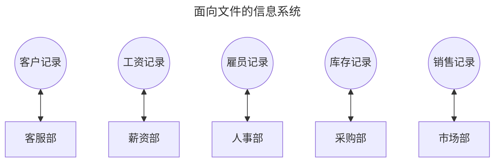
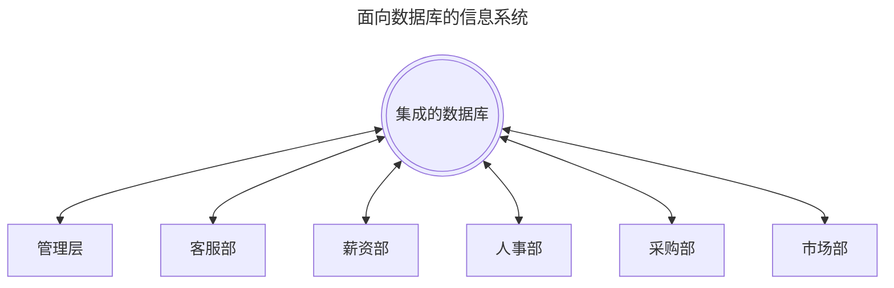
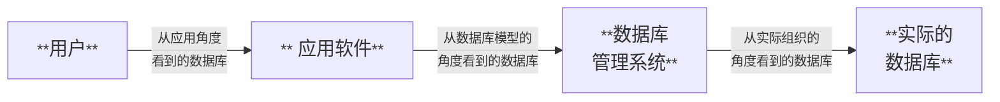

# 第 9 章  数据库系统

数据库是一个将大量数据转化成**抽象工具**的系统，允许用户以一种简便的方式搜索和提取相关的信息项。本章讨论这个主题，还将讨论与**数据挖掘**相关领域和传统的**文件结构**。

> * **抽象工具**：是一种用于简化复杂系统的思维和设计工具。
>
>   它通过隐藏系统的复杂细节，提供高层次的视图和接口，使开发者能够更容易地理解、设计和管理系统。 这些工具可以是概念性的，也可以是实际的编程工具和技术。
>
> * **数据挖掘**：是从大型数据集中提取潜在的、有用的信息和知识的过程。
> * **文件结构**：是指组织和存储数据的方式，以便文件系统能够高效地管理和访问这些数据。

**持久理解**

* **人们使用计算机程序来处理信息从而获得深入理解和知识**。

* **计算有助于探索和发现信息中的联系**。

  > **计算**：指利用算法或过程对数据进行处理和操作，以获得结果。

* **计算几乎在每个领域都能实现创新**。

* **计算对任何社会有全球性影响——既有有利的也有有害的**。

* **数据库系统应用抽象将大型数据集合转换为有用的信息源**。

**基本知识点**

* 大型数据集的有效使用需要计算解决方案**。

## 9.1  数据库基础

>  The term database refers to a collection of data that is multidimensional in the sense that intenal links tetween its entries make the information access-sible from a variety of persepectives.

**数据库**（database）是一种多维的数据的集合，之所以说是多*维*的，是因为在这种集合中，通过两个数据项之间的内部链接，可以从不同的角度来获取信息。

数据库是一个用于组织、存储和管理数据的结构化集合。它能让用户方便地访问、更新和管理数据。数据库的设计旨在有效地处理大量数据，同时提供书数据的一致性、安全性和完整性。

> 维（dimension /dɪˈmenʃn/）：构成空间的每一个因素（如长、宽、高等）叫做一维，也就维度。

### 9.1.1  数据库系统的重要性

一图胜千言……

如果能以有意义的方式访问信息，就可以用这种**信息集成池**提供的有价值的资源做出管理决策。

> **信息集成池**（Information Integeration Pool）：是一个概念或技术框架，用于整合来自不同来源的数据和信息，以创建一个统一的**视图**或访问点。
>
> > **视图**：在数据库系统中，“视图”是一个虚拟表，它是基于数据库中一个或多个真实表的数据生成的。视图不存储实际的数据，而是存储一个查询，该查询定义了如何从基础表中提取数据。 当用户访问视图时，数据库系统执行该查询并返回结果集，就像访问一个实际的表一样。

**基本知识点**

* 大型数据集包括交易、测量、文本、声音、图像和视频等数据。

### 元数据是关于数据的数据

**元数据**（metadate/ˈmet.əˌdeɪ.tə/）：指的是关于其他类型数据的信息。

**基本知识点**

* 元数据是关于数据的数据。
* 元数据可以是关于图像、网页或其他复杂对象的描述性数据。
* 元数据可以通过提供数据 各个方面的附加信息来增加那个数据或数据集的有效使用。

### 9.1.2  模式的作用

数据库技术的迅速发展有一个缺点，即潜在的敏感数据可能会被未经授权的人访问。因此，对数据库中信息的访问控制能力和共享它的能力同等重要。

为了让不同的用户访问数据库中的不同信息，通常数据库系统都依赖**<big> 模式</big>**和**<big>子模式</big>**。

* **模式**（schema /ˈskiː.mə/，图解；略图）：是整个数据库结构的一个描述，数据库系统用模式来维护数据库。
* **子模式**（subschema）：只是与特定用户需求相关的那部分数据库的一个描述。

虽然子模式是管理敏感信息使用权的有用工具，但实践中，非常大型的动态分布式数据库很难保护。重叠子模式之间的交互、系统的物理或网络安全缺漏以及不可靠的人类操作员都为受保护的数据库内容被滥用提供了机会。

**基本知识点**

* 隐私和安全问题出现在计算系统和制品的开发和使用中。
* 维护包含个人信息的大型数据集的隐私可能是具有挑战性的。

### 9.1.3  数据库管理系统

一个典型的数据库应用涉及多个软件层，我们将其分为两个主要的层：应用层和数据库管理层。

注意， 应用软件并不直接操纵数据库，数据库实际是由**数据库管理系统**（Database Management System，DBMS）操纵的。

### 9.1.4  数据库模型

**数据库模型**（database model）：指的是用于组织和管理数据库中的数据的结构、操作和关系的框架或体系。数据库模型定义了如何存储、组织和操作数据，以确保数据的完整性、效率和可扩展性。不同的数据库模型适用于不同的数据类型和应用需求。

寻找更好的数据库模型的工作永无止境，起目标就是要找到能够容易地把复杂的数据库系统概念化的模型，从而形成简明的表达信息请求的方式，产生高效的数据库管理系统。