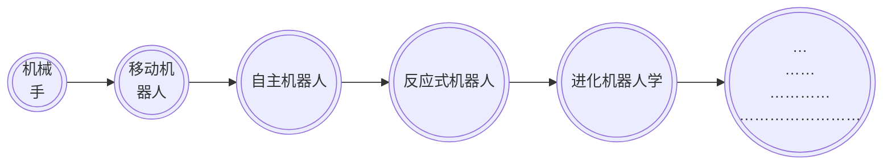

## 11.6  机器人学

**机器人学**（robotics/rəʊˈbɒt.ɪks/ ）：是指研究具有智能行为的和物理特性（有形）的自主智能体。它涵盖了人工智能的所有研究范围，还借鉴了很多机械和电气工程方面的知识。 与所有的智能体一样，机器人所处的环境中必须能够感知、推理和行动。

### 11.6.1 机器人学的发展和技术应用

## 11.7  后果的思考

毫无疑问，人工智能取得的进步有造福人类的潜力，人们很容易热衷于这些潜在的好处。然而，这也为将来留下了后患，它的破坏性后果与带来的好处同样巨大。这种差异常常只是一个人的观点或者一个人的社会地位不同引发的——彼之所得，此之所失。

* 有些人把技术进步看作给予人类的一份厚礼——将人类从枯燥的、单调的任务中解放出来，为令人愉悦的生活方式打开大门。
* 另一些人则把技术进步看作剥夺公民就业机会、把财富引向权势人物的祸根。

制造越来越智能的机器的后果，比设计不同社会阶层之间的权力斗争的后果更加微妙、更加根本、也更加严重。这些问题触及了人类自身形象的核心：

1. **面对机器的智力向人类智力挑战的冲击，社会会如何应对？**
2. **机器能力的进步远远超过我们的适应能力，那么人类会如何应对呢？**
3. **机器的“智能”能力已经变得可与人类相匹敌，社会将怎样应对这种局面呢？**
4. **越来越多的领域里机器的表现优于人类，个人的自尊心会受到怎样的影响呢？**
5. **如果计算机操纵了社会，那么究竟是谁、或什么掌管控制着我们的人类社会呢？**