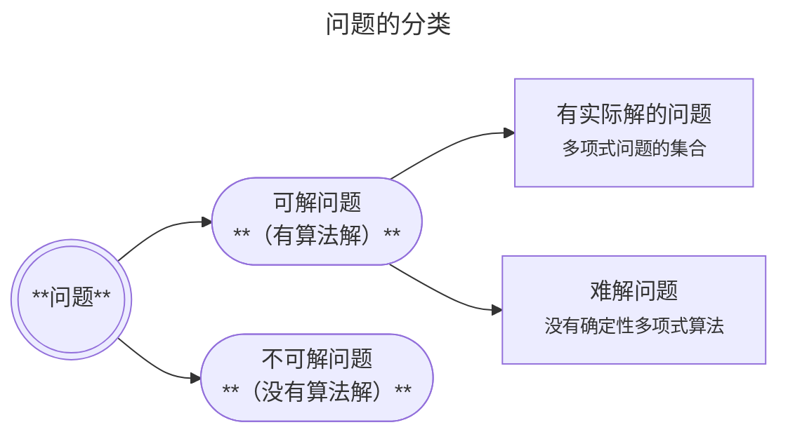

## 12.5  问题的复杂性

如果一个问题可解，那么这个可解的问题是否有实际解？ 有些问题在理论上是可解的，但由于过于复杂，从实际的观点来看，它们是不可解的。

>  有些问题虽然有解，但需要花费大量甚至超过了人们可以承受的时间限度，因此该问题变成了“不可解”问题。这不是由于问题本身无法解决，而是时间资源的稀缺性决定的。正如，时间无始无终、无生无灭、永恒存在，但对于每个人、社会、国家、事物都是极其有限的。

问题的复杂性，首先，是解决问题所花费的时间角度来衡量的，即**时间复杂性**（time complexity）。其次，问题的复杂性，还可以用**空间复杂性**（space complexity）来度量。 **时间复杂性**：是指如果一个问题的所有解都需要大量的时间，就认为认为这个问题是复杂的。 **空间复杂性**：是指解决一个问题所需存储空间的量。

**利（使）用空间也要花时间**，这是一个很常见的现象。所以，一个问题的空间复杂性永远不会比它的时间复杂性增长得更快。

**基本知识点**

* **效率既包括执行时间的使用又包括存储器的使用**。

### 12.5.1  问题复杂性的度量

问题复杂性的度量，是指衡量哪些问题比另一些问题更为复杂，并最终确定出哪些问题太过复杂，以致实际上不能解。问题复杂性的度量是从解题的复杂性角度来衡量一个问题的复杂性。 一般认为，简单问题有简单的解法；复杂问题就没有简单的解法。注意这样一个事实，一个问题有一个困难的解并不一定意味着该问题本身很复杂。毕竟，一个问题可以有很多解，而其中的某个解必然会复杂些。所以，**如果要确定一个问题本身很复杂，就需要证明它的所有解都不简单**。

在计算机科学领域中，问题的复杂性取决于解决该问题的算法的特性。更准确地说，**解决一个问题的最简单算法的复杂性可以被认为是该问题本身的复杂性**。

* 从程序开发的角度看，算法复杂性倾向于度量一个**算法在表示中所遇到的难度**，而不是算法本身的复杂性。
* 从计算机的角度看，算法复杂性是度量执行算法时必须完成的步骤数。即执行这个算法时所花费的时间。

在解一个问题时，如果存在一个算法，其时间复杂性为`Θ(f(n))`（Θ：theta/ˈθiː.tə/，希腊字母表的第 8 个字母），并且解决该问题的其他算法没有比这更低的时间复杂性，那么我们就定义这个问题的时间复杂性是属于`Θ(f(n))`的。

* 这里`f(n)`是 n 的某个数学表达式。

也就是说，**一个问题的时间复杂性被定义为该问题的最优解的时间复杂性**。

### 12.5.2  多项式问题与非多项式问题

假设`f(n)`和`g(n)`是数学表达式。如果说`g(n)`受`f(n)`的约束，就意味着当把这些表达式用在越来越大的 n 值上时，`f(n)`的值最终会大于`g(n)`的值，并且对于所有更大的 n 值，`f(n)`都将大于`g(n)`。

如果一个问题是属于 `O(f(n))`的，其中表达式`f(n)`要么本身是一个多项式，要么受一个多项式约束，我们就说，这个问题是一个**多项式问题**（polynomial[/ˌpɒl.iˈnəʊ.mi.əl/多项式] problem）。

所有多项式问题的集合用**P**表示。

多项式问题是关于求解该问题所需时间的一种陈述。我们经常会说：

* P中的问题能够在多项式时间内解决；
* 该问题有多项式时间解。

P 类之外的问题其特征是具有极长的执行时间，即使是对中等规模的输入也是如此。理论上可解，但不属于 P 的问题有巨大的时间复杂性，这一事实让我们得出结论： **从实践角度看，这些问题本质上是不可解的。**

从而类型 P 成了用来区别难解的问题和那些可能有实际解的问题的重要分界线。因此，对类型 P 的理解已经成了计算机科学领域的一个重要研究内容。

**基本知识点**

* 合理时间的意思是算法所采用的步骤数小于或等于输入大小的多项式函数（常量、线性、平方、立方等）。

### 12.5.3  NP问题

**非确定性指令**，是指依赖于执行程序的机制的创造性来自行决定的指令。

**非确定性算法**（nondeterministic /ˌnɒn.dɪ.tɜː.mɪˈnɪs.tɪk/ algorithm），是指包含非确定性指令的算法。

**非确定性多项式问题**（nondeterministic polynomial problem）：是指一个能够在多项式时间内用非确定性算法解决的问题。简称**NP 问题**（NP problem），习惯上把 NP 问题表示成 NP。 注意：P 中的所有问题也都属于 NP，这是因为任何确定性算法都可以加上一条非确定性指令而不影响其性能。

**NP 完全问题**（NP-complete problem），是指任何一个问题的多项式时间解也为所有其他 NP 类问题提供了一个多项式时间解。也就是说： 如果能够在多项式时间内找到一个确定性算法，使其能够解决一个 NP 完全问题，那么这个算法就能推广到以多项式时间来解决任何其他 NP 类问题。于是，NP类和 P 类一样了。

----

#### 确定性的与非确定性的

确定性算法**不依赖于**执行该算法的机制的创造性能力。

* 如果用同样的输入数据反复执行一个确定性算法，那么每次都会完成同样的动作。

非确定性算法**依赖于**执行该算法的机制的创造性能力。

* 如果用同样的输入数据反复执行一个非确定性算法，那么将会产生不同的动作。

-----

**启发式技术**是指可以在典型的方法无法找到精确解的时候找到近似解的技术。

* 一些问题可以解，但不能在合理时间内解。在这些情况下，启发式方法可能有助于在合理时间内找到解。
* 当精确方法太慢时，启发式方法可能有助于更快地找到近似解。

