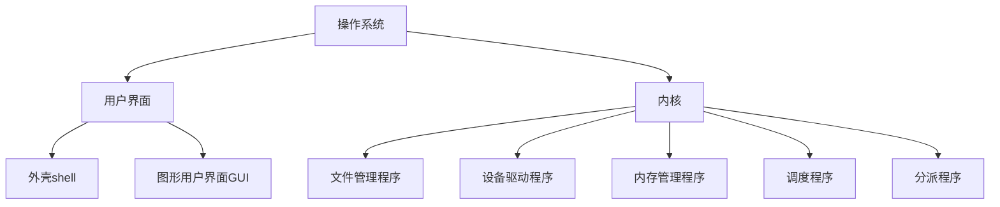

# 第3章  操作系统

**操作系统**是用来协调计算机的内部活动以及检查计算机与外部世界通信的软件包。

* 操作系统是控制计算机整体运行的软件。
* 操作系统执行用户程序、协调活动并管理系统资源。
* 网络安全是操作系统和操作系统软件的一个重要关注点。

> [!IMPORTANT]
>
> ***要成为有知识的计算机使用者***。

操作系统为用户提供可以存储和检索文件的方法、提供可以请求执行程序的接口，以及执行所请求程序所需的环境。

操作系统有很多，目前比较著名的有：

* Windows，微软公司已经发布了很多版本，广泛用于 PC 领域。
* UNIX，是较大的计算机系统和 PC 的流行选择，它也是其他两个流行操作系统的核心：
  * macOS，是 苹果公司为其一系列 Mac 机提供的一种操作系统。
  * Solaris，是 Sun Micrsystems（现归 Oracle 所有）开发的。
* Linux，运用于大型机和小型机，该系统最初是由一些计算机爱好者以非营利的目的开发的。到目前为止，包括 IBM 公司在内的许多商业机构都发布了 Linux 操作系统。

## 3.1  操作系统的历史

每个程序的执行称为一个**作业（job）**，它是作为一个独立的活动处理的——为执行该程序准备好机器，执行程序，然后在下一个程序的准备工作开始之前，必须重新获取磁带、穿孔卡片等所有一切。

**批处理（batch processing）**，是指把若干个要执行的作业收集到一个批次中，然后在不需要与用户进行进一步的交互的情况下执行它们。在批处理系统中，驻留在海量存储器中的作业在**作业队列（job queue）**里等待执行。

* **队列（queue）**是一种存储组织，其中对象（这里指作业）按照**先进先出（first-in，first-out，FIFO）**的方式在队列里排队。

**交互式处理（interactive processing）**，是指允许执行一个程序来通过远程终端与用户对话。

**实时处理（real-time processing）**，是指计算机被强制在一个期限内执行任务，其中所完成的动作被称为是实时发生的。也就是说，要是说一台计算机是实时完成任务的，意思就是，计算机按照其（外部现实世界的）环境的最后期限完成任务。

**分时（time-sharing）**是指能同时给多个用户提供服务的操作系统的一种特性。实现分时的一种方式是使用称为**多道程序设计（multiprogramming）**的技术，其中时间被分成时间片，然后每个作业的执行被限制为每次仅一个时间片。在每个时间片结束时，当前的作业暂时搁置，让另一个作业在下一个时间片里执行。通过这种方式可以快速地在各个作业之间进行切换，形成若干个作业同时执行的<big>~~错觉~~</big>。

多道程序设计既可用于单用户系统，也可以用于多用户系统，前者称为**多任务处理（multitasking）**，即是指一个用户同时执行多个任务。

简而言之，操作系统已经从一次获取和执行一个程序的简单程序，发展为能够协调分时，能够维护机器海量存储设备上的程序和数据文件，也能够直接响应计算机用户请求的复杂系统。

但是，计算机操作系统的发展仍在继续。多处理器机器的发展已经通过把不同的任务分配给不同的处理器进行处理，并且采用分时机制共享单个处理器，让操作系统拥有了分时/多任务处理能力。这些操作系统必须处理**负载平衡（load balancing）**，即把任务动态地分配给各个处理器，以便所有处理器都得到有效的利用，还要**均分（scaling）**即把一个任务划分为若干个子任务，其数量与可用处理器数量相一致。

此外，把相距很远的大量机器连接在一起的计算机网络的出现导致了协调网络活动的软件系统的诞生。计算机网络领域在许多方面拓展了操作系统这个学科，其目标是跨多个用户和多个机器管理资源。

操作系统的另一个研究方向聚焦在专用于特定任务的设备，如医疗设备、车载电子设备、家用电器、手机或其他手持计算机。这些设备中的计算机系统称为**嵌入式系统（embedded system）**。

## 3.2  操作系统的体系结构

为了理解典型操作系统的组成，这里我们首先考虑在典型的计算机系统中能找到的所有软件，然后再专门研究操作系统本身。

### 3.2.1  软件概述

``````mermaid
graph TD;
    软件 --> 应用软件; 
    软件 --> 系统软件; 
    
系统软件 --> 实用软件; 
系统软件 --> 操作系统;
操作系统 --> 用户界面;
操作系统 --> 内核;
``````

* 软件：是指一系列用于控制计算机硬件进行特定任务指令和数据。分为：
  * 应用软件：是由一些完成机器特定任务的程序组成的。
  * 系统软件：控制计算机整体运行的软件。分为：
    * 实用软件：是由一些能够扩充（或定制）操作系统功能的软件单元组成的。
    * 操作系统：是用来协调计算机内部活动以及检查计算机与外部世界通信的软件包。

#### Linux

对计算机爱好者而言，如果想通过亲手实验来了解一个操作系统，那么就应该选择 Linux。

* Linux 操作系统最初是由 Linus Torvalds 在赫尔辛基大学学习期间设计的。
* Linux 操作系统是一个非专有产品，我们可以免费获得它的源代码和相关文档。
* Linux 操作系统被认为是当今可用的较可靠的操作系统之一。

### 3.2.2 操作系统组件

为了完成计算机用户请求的动作，操作系统必须能够与这些用户进行通信。操作系统负责与用户进行通信的部分，通常称为**用户界面（user interface）**。老式的的用户界面称为**外壳（shell）**，通过键盘和显示器用文本信息与用户通信。更现代化的系统利用**图形用户界面（graphical user interface，GUI）**实现与用户的通信，其中操作的对象（如文件和程序）被表示为显示屏上的图标（icon）。这些系统允许用户使用某种常用的输入设备发出命令。

例如，有一个或多个按键的计算机鼠标可用来单击或拖拽屏幕上的图标。最近，高密度触摸屏的进步使得用户可以直接用手指操作图标。如今，GUI 使用二维图像投影系统，三维界面允许人类用户通过 3D 投影系统、触觉感知设备和环绕声音频再生系统与计算机进行通信，这些都是当前研究的课题。

虽然操作系统的用户界面在实现机器的功能上扮演了重要的角色，但它仅仅是计算机用户与操作系统真是内核之间的一个接口而已。用户界面与操作系统内部之间的区别主要表现在：<br>一些操作系统准许用户从各种界面中选择最合适的界面为自己服务。

现在的 GUI shell 中的重要组件是**窗口管理程序（Windows manager）**，该程序在屏幕上分配若干个称为窗口的块，跟踪与每个窗口相联系的应用程序。

与操作系统的用户界面相对，我们把操作系统的内部部分称为**内核（kernel**/ˈkɜː.nəl/）。操作系统的<big>*内核包含一些完成计算机安装所需的极基本功能的软件组件*</big>。

* 其中一个组件是**文件管理系统（file manager）**，它的工作是协调机器海量存储器设施的使用。更准确地说，文件管理程序维护着存储在海量存储器上的所有文件的记录，包括每个文件的位置、哪些用户有权访问各种文件以及海量存储器里的哪些部分可以用来建立新文件或扩充现有文件。
* 另一个组件是**设备驱动程序（device driver）**，它们负责与控制器（有时直接与外围设备）通信，以操作连接到机器的外围设备的软件单元。
* 还有一个组件是**内存管理程序（memory manger）**，它担负着协调机器使用主存储器的任务。
* 操作系统内核中还有**调度程序（scheduler** /ˈʃedʒ.uː.lər/）和**分派程序（dispatcher** /dɪˈspætʃ.ər/）。



### 3.2.3  系统启动

启动是通过**引导**（**boot strapping**，简称为 **booting**）过程实现的，这个过程是由计算机每次启动的过程完成的。正是这个过程把操作系统从海量存储器（操作系统永久存储的地方）传送到主存储器中（在机器首次开机时，主存储器实际上是空的）。<br>执行**引导装入程序**从而启动操作系统的整个过程称为**引导**（**booting**）计算机。<br>在通用计算机中，**引导装入程序**（**boot loader**）被永久存储在机器的**只读存储器**（real-only memory，**ROM**）中。<br>它是一种内容可以读取，但不可以改变的存储器，因此被称为**只读存储器**（real-only memory，**ROM**）。

在计算机开机的时候，最先执行**引导装入程序**。引导装入程序中的指令引导 CPU 把操作系统从海量存储器中预先定义的位置调入主存储器。一旦操作系统被放入主存储器，引导装入程序就引导 CPU 执行跳转指令，转到这个存储区。这时，操作系统接管并开始控制机器的活动。


* 在嵌入式系统（如只能手机）中，操作系统是从特殊的闪速存储器（非易失性）复制的。
* 在大型公司货大学的小型工作站中，可能要通过网络从远程机器上复制操作系统。

#### 固件

**固件**（**Firmware**）是用于控制和管理硬件设备的小型软件程序。它是一种嵌入在硬件中的专用软件，通常存储在设备的只读存储器（ROM）、可编程只读存储器（EPROM）或闪存中。

**固件更新**（**firmware update**），是指更新存储在 ROM 中的操作系统和引导装入程序。

## 3.3  协调机器的活动

协调机器的活动是指操作系统如何协调应用软件、实用软件以及操作系统自身的内部软件单元的执行。

### 3.3.1 进程的概念

现代操作系统的一个最基本的概念是*程序* 与*执行程序的活动*之间的区别：

* 程序是一组静态的指令；
* 执行程序的活动是一个动态的活动，执行程序的活动的属性会随着时间的推进而改变。

**进程**（**process**）是指在操作系统的控制下执行某个程序的活动。

**进程状态**（**process state**）是指与进程联系在一起的活动的当前状态。这个状态包含正在执行的程序的当前位置（程序计数器的值），以及其他 CPU 寄存器的相关存储单元中的值。

操作系统的任务就是管理这些进程，使每个进程都有其需要的资源，确保独立的进程不会相互干扰，确保需要交换信息的进程能够交换信息。

### 3.3.2  进程管理

与协调进程的执行有关的任务是由操作系统内核中的*调度程序*和*分派程序*处理的。调度程序维护一个有关计算机系统中的*进程池*（现存进程的记录），将新进程加到进程池中，并把已经完成的进程移出进程池。这样，当用户请求执行一个应用时，调度程序就把这个应用加到当前进程池加以执行。

为了跟踪所有的进程，调度程序在主存储器中维护着一个称为**进程表**（**process table**）的信息块。每当要请求程序执行时，调度程序都在进程表中为该程序创建一个新的表项。这个表项包含分配给该进程的存储区域（从内存管理程序得到的）、进程的优先级以及该进程是处于就绪状态还是处于等待状态这样的信息。<br>如果进程能够继续执行，那么该进程就处于**就绪**（**ready**）状态；<br>如果进程因要等待某个外部事件的发生而延迟，那么该进程就处于**等待**（**waiting**）状态。

分派程序是内核的一个组件，它监督被调度的进程内实际执行。在分时/多任务处理系统中，这个任务是由**多道程序设计**（**multiprogramming**）完成的；也就是说，先将时间划分为小的时间段，每段称为一个**时间片**（**time slice**），通常用毫秒（ms）或微秒（μs）来计量，然后切换 CPU 的注意力，允许每个进程一次执行一个时间片。<br>这种从一个进程变换到另一个进程的过程称为**进程切换**（**process switch**）或**上下文切换**（**context switch**）。

每次分派程序给进程分配一个时间片时，都会初始化一个计时器电路，通过产生一个称为**中断**（*interrupt*）的信号来指示时间片的结束。当CPU 收到中断信号时，它会完成当前的机器周期，保存它在当前进程中的位置，然后开始执行一个称为**中断处理程序**（**interrupt handler**）的程序，该程序存储在主存储器中预先定义的位置上。中断处理程序是分派程序的一部分，用来描述分派程序如何响应中断信号。

#### 中  断

中断是用来终止时间片的，这只是计算机终端系统中众多应用中的一个。有许多可以产生中断信号的环境，每个都有自己的中断例程。事实上，中断为协调计算机的活动与相关环境提供了一个重要的工具。

为了管理识别和响应中断的任务，不同的中断信号被赋予了不同的优先级，以便较重要的任务能够得到优先处理。最高级别的中断通常与电源故障相关，如果计算机电源意外中断就会产生这样的中断信号。相关的中断例程会赶在电压降到不能再进行操作前的几毫秒时间内，引导 CPU 完成一系列的“内务”琐事。

因此，中断信号的作用就是抢占当前进程，将控制权传回分派程序。此时，分派程序从进程表的就绪进程中选择优先级最高的进程（由调度程序确定），重启计时器电路，让所选的进程开始它的时间片。

多道程序设计系统能够成功的最大关键是能够停止一个进程并在稍后重启这个进程。简言之，多道程序设计系统能够重新建立起中断前的那个环境。

## *3.4  处理进程间的竞争

操作系统的一个重要任务就是将机器的各种资源分配给系统中的各个进程。从广义上讲，我们所用的**资源**（**resource**）这个术语，不仅包括机器的外围设备，还包括机器本身的特性。<br>文件管理程序分配对文件的访问，并为新文件的建立分配海量存储空间；<br>内存管理程序分配内存空间；<br>调度程序分配进程表中的空间；<br>分派程序分配时间片。

**要记住**：==机器不会自己思考，机器只是遵照指令办事。==因此，为了构建一个可靠的操作系统，我们必须设计算法克服各种可能出现的意外情况。不管意外情况出现的概率有多小。

### 3.4.1  信号量

**信号量**（**semaphore** /ˈsem.ə.fɔːr/，旗语）是指一个正确实现的标志。信号量源自用于控制轨道区段的铁路信号。事实上，信号量在软件系统里的用法与其在铁路系统里的用法是一样的。就像一个轨道区段一次只能有一列列车通过，**一个指令序列一次也只能由一个进程执行**。这样的一个指令序列称为**临界区**（**critical region**）。这种一次只允许一个进程执行一个临界区的要求称为**互斥**（**mutual exclusion**/ˈmjuː.tʃu.əl ɪkˈskluː.ʒən/）。

概括地说，获得对一个临界区的互斥的常用方法是用一个信号量守护这个临界区。一个进程要进这个临界区，就必须确定这个信号量是清零的，并在进入临界区之前把它置位；然后出临界区时把这个信号量清零。如果发现这个信号量在置位状态，那么试图进入临界区的进程必须等待，直到这个信号量被清零。

###  3.4.2  死锁

**死锁**（**deadlock**/ˈded.lɒk/，僵局、死结、僵持），是指两个或更多的进程中的每一个都在等待已分配给另一个的资源，导致进程被阻塞，不能继续执行的状态。

只有以下 3 个条件全部满足，死锁才会出现：

1. 存在对不可共享的资源的竞争。
2. 这些资源是在不完整的基础上被请求的；<br> 也就是说，一个进程已经收到了某些资源，稍后还将请求更多资源。
3. 一个资源一旦被分配出去，就不能强行收回。

破坏这 3 个条件中的任何一个，就能消除死锁问题。有以下两种解决方案：

* 死锁检测和改正方案：
  * 该方案主要解决第三个条件即“一个资源一旦被分配出去，就不能强行收回”的问题。
  * 具体方法是：在死锁出现的时候检测出它，然后通过强制收回某些已经分配的资源来改正它。
  * 例如：进程表已满就属于这种情况。
    * 如果死锁是由于进程表满产生的，那么操作系统中的例程可以移除[专业术语称为**杀死**（**kill**）]一些进程，释放一些进程表空间，打破死锁并使得剩下的进程可以继续完成它们的任务。
* 死锁避免方案：
  * 该方案着力于抑制前两个条件的技术，即存在对不可共享的资源的竞争；资源在不完整的基础上被请求。
    * 针对“存在对不可共享的资源的竞争”的解决方案：
      * 不是直接消除竞争，而是把不可共享的资源转变为可共享的资源。
    * 针对“这些资源是在不完整的基础上被请求的”方法是：
      * 要求每个进程一次性请求它所需要的全部资源。

**假脱机**（SPOOLing**，Simultaneous Peripheral Operations On-Line）：是指保存数据供以后在合适的时候输出的技术。是一种允许多个进程访问一个公共资源的技术。

#### Python 和操作系统

当一个用户执行一个 Python 脚本时，操作系统会启动一个新进程来运行这个脚本。这种脚本通常是应用软件，但如果它们扩展或定制了系统的功能，也可以被视为实用软件。

Python 脚本通过与操作系统的组件进行交互来完成它们的工作。

Python 模块`os`提供了各种预定义的、系统无关的函数，用于访问操作系统的通用特性。

#### 多核操作系统

一台多核计算机包含多个独立的处理器（称为核），它们共享计算机的外围设备、内存和其他资源。

对于一个多核操作系统，这意味着分派程序和调度程序必须考虑在每个核上应该执行哪些进程。

传统的分时/多任务处理系统通过以快过人类感知的速度快速切换时间片，制造了同时执行多个进程的假象。<br>现代系统继续通过这种方式实现多任务处理，但最新的多核 CPU 确实能够同时运行 2 个、4 个或更多个进程。

## 3.5  安全性

计算机操作系统在维护安全性（包括可靠性）方面起重要的作用。计算机系统的安全性需要一个精心设计的可靠的操作系统。

### 3.5.1  来自外部的攻击

操作系统的一个重要任务就是，**保护计算机的资源不被未授权的个体访问**。在多人使用计算机的情况下，操作系统一般会通过为不同的授权用户建立“**帐户**”的方法来标记不同权限的用户。<br>**帐户**是操作系统内的一条包含授予该用户的诸如用户名、口令和权限等条目的记录。帐户由一个称为**超级用户**（**super user**）或**管理员**（**administrator**）的人创建。<br>这个人他国将自己标识为管理员（通常是通过用户名和口令）来获得操作系统的高度访问特权。这个联系一旦建立，管理员就可以更改操作系统内的设置、修改关键的软件包、调整授予其他用户访问系统的权限，进行一般用户不能进行的活动。

操作系统在每个**登录**（**login** /ˈlɒɡ.ɪn/，进入系统，登录；登录名）过程中使用这个信息控制用户对系统的访问。<br>**登录**是一个事务序列，在这个过程中用户与计算机操作系统建立初步联系。

**审计软件**（**auditing software**）是实用程序软件，用来记录和分析发生在计算机系统内的活动。它的另一个目的是检测**嗅探软件**（**sniffing software**）。<br>**嗅探软件**是指在计算机上运行时能够记录活动并在稍后将之报告给潜在的入侵者。

==计算机系统安全性的其中一个主要障碍居然是**用户自己的粗心大意**。==

#### 口令安全

将几个通常不会一起出现的中等长度的单词组合成一个短语，再混合上不同的大小写和数字或标点符号，就能造出不容易被猜到或被偶然发现的容易记住的心理故事。

### 3.5.2  来自内部的攻击

有特权指令和特权级别的控制是操作系统维护安全性可用的一个主要工具。

#### 多因素认证

对于人类使用弱口令来保护计算机帐户存在的普遍问题，一个解决方案是需要一个以上的证据才能获得访问权限。

* 口令是一个认证因素。
* 用户拥有的东西是第二个认证因素。如 ATM 卡、专用安全令牌、具有特定电话号码的智能手机等。
* 用户自身是第三个认证因素。如用户的指纹、语音、视网膜图案等。