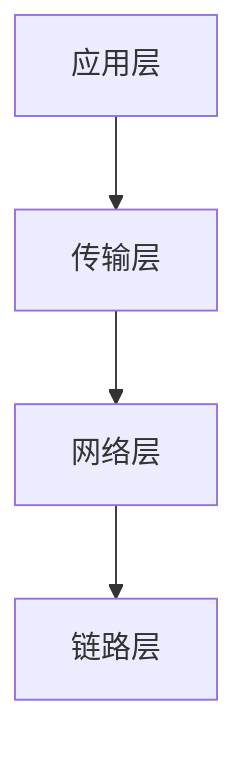
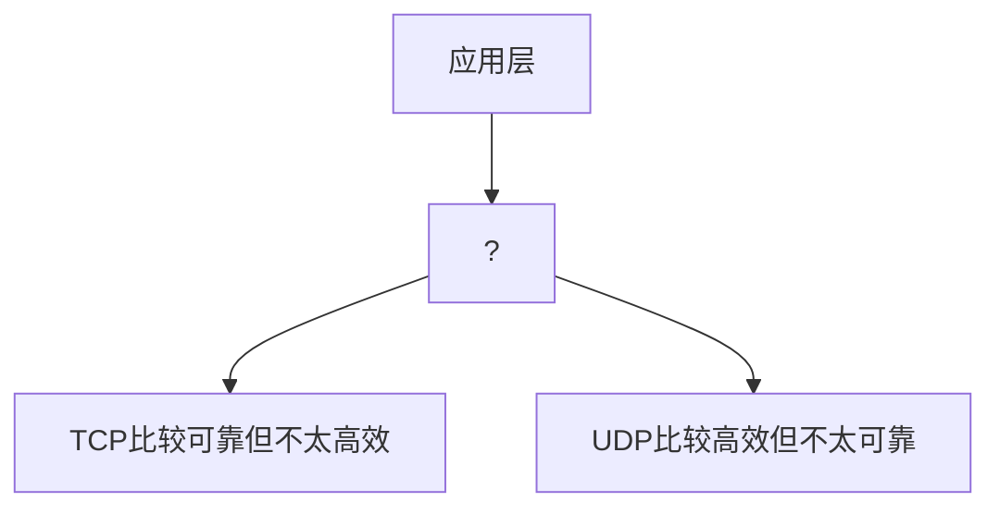

# 第4章  组网及因特网

本章讨论计算机科学中被称为组网的领域，包括学习如何将计算机连接起来共享信息和资源。学习内容包括网络的结构与操作、网络的应用以及网络安全问题。学习的重要主题是遍布世界范围的特殊网络——因特网。

## 持久理解

**因特网是一个自治系统网络**。

**英特网的特点影响着建立在其上的系统**。

**网络安全是因特网和建立在其上的系统的重要关注点**。

**计算增强了沟通、互动和认知**。

**计算对人和社会有全球性的影响（既有有益的又有有害的）**。

**计算革新既影响着设计和使用它们的经济、社会和文化环境，又受这些环境的影响**。

**网络**（**network**）是指为了使计算机之间共享信息和资源而相互连接的计算机系统。

## 4.1  网络基础

从多种基本的组网概念开始学习网络。

### 4.1.1  网络分类

计算机网络按照通信范围可以分为：

* **个人域网**（personal areanetwork，**PAN**）
  * 通常用于小范围的通信，一般只有几米远。
  * 如：
    * 网线耳机与智能手机之间的通信。
    * 无线鼠标与 PC 之间的通信。
* **局域网**（local area network，**LAN**）
  * 通常有一个建筑物或者一个建筑群中的若干计算机组成。
  * 例如，
    * 大学校园中的计算机可以通过局域网连接。
    * 制造厂中的计算机可以用局域网连接。
* **城域网**（metropolitan area network，**MAN**）
  * 城域网属于中型网络。
  * 如横跨一个本地社区的城域网。
* **广域网**（wide area network，**WAN**）
  * 广域网能连接距离更远的机器。
  * 如相邻的城市或者世界的两端。

计算机网络按照内部操作的设计分为：

* **开放式**（open）网络
  * 网络的内部操作是基于公共领域而设计。
  * 如：全球因特网。
* **封闭式**（close）网络或称**专有**（proprietary）网络
  * 基于特定实体（如个人或公司）所拥有并控制的创新。

计算机网络按照网络的拓扑分为：

* 总线拓扑，即所有机器都通过同一条被称为“总线”的公共通信线路连接起来。
* 星型拓扑，即将一台机器作为中心焦点，所有其他机器都与之相连。其中，这台中央机器被称为**接入点**（access point，**AP**），是协调所有通信的焦点。

> **网络拓扑**（network topology/tɒpˈɒl.ə.dʒi/结构、构造）是指计算机网络中的各个节点之间的连接方式和结构布局。
>
> 网络拓扑描述了网络的物理或逻辑排列方式，它决定了数据在网络中的传输路径和方法。了解网络拓扑对于设计和管理高效、可靠的网络至关重要。

### 4.1.2  协议

**协议**（**protocol**/ˈprəʊ.tə.kɒl/）：是指为了计算机网络运行可靠，而建立和执行的网络活动的规则。

通过开发和采纳协议标准，厂商能够生产出与其他厂商的网络应用产品相兼容的产品。因此，在网络技术的开发中，协议标准的开发是一个必不可少的环节。

### 4.1.3  组合网络

有时候，需要连接现有网络以形成一个扩展的通信系统，这可以通过将网络连接成一个相同“类型”的更大的网络来实现。

例如，针对基于以太网协议的总线网络，通常可以将总线连接起来形成一根长总线。这可以通过中继器、网桥、交换机等不同的设备来完成，这些设备之间的区别既微妙又信息量巨大。

> 以太网（Ethernet /ˈiː.θə.net/）：是一种用于有线局域网（LAN）的通信协议。

* *中继器*（repeater）：是在两个原始总线间简单地来回传送信号（通常有某种形式的放大）的设备，而不考虑信号的含义。
* *网桥*（bridge）：与中继器相似，连接两条总线，但不是在连接上传输所有的报文。而是，检查每条报文的目的地址，当报文地址是另一端的计算机时才在连接上转发这个报文。因此，网桥同一端的两台机器可以在不干扰另一端发生的通信的情况下交换报文。
* *交换机*（switch）：本质上就是具有多个连接的网桥，可以连接若干条总线，不止两条。因此，交换机形成的网络包括若干从交换机延伸出来的总线“辐条”。交换机也要考虑所有报文的目的地址，并且仅仅转发那些目的地是其他“辐条”的报文。

但，**无论是何种设备，其起到的作用其实都是“一根延长的总线”**。

需要重点注意的是，当计算机通过中继器、网桥和交换机连接时，形成的是一个大型网络。使用相同协议的整个网络系统已相同的方式运作，就像每个规模较小的原始网络一样。

----

**互联网**（***i*nternet**）：由两个不同以上不同协议的网络建立起来的一个网络的连接方式。在这个网络中，原始网络仍然保持其独立性，并且继续作为独立的网络运行。

**因特网**（***I*nternet**）：一种独特的、世界范围的互联网。

==注意，通用术语**互联网**（**i**nternet）不同于**因特网**（**I**nternet）==。

**路由器**（router /ˈruː.tər/）：是一种用来传送报文的专用计算机。它是把网络连接起来形成互联网的设备。<br>注意：路由器的任务与中继器、网桥和交换机不同，路由器提供的是网络之间的链接，并允许每个网络保持其独特的内部特性。之所以叫路由器是因为它们的用途是*向适当的方向转发报文*。

**网关**（gateway /ˈɡeɪt.weɪ/）：是一个网络与互联网链接的“点”，也是网络与外部世界之间的通道。<br> 网关有多种形式。

### 4.1.4  进程间通信的方法

**进程间通信**（interprocess communication）：是指网络中的不同计算机在执行各种活动或进程的过程中，为协调行动并完成指派的任务而进行的通信。

> 进程：是指在操作系统的控制下执行某个程序的活动。

进程间通信主要采用如下两种方式：

* **客户/服务器模式**（client/server/ˈsɜː.vər/ model）：是一个服务器（进程）为许多其他客户机（多个进程）提供服务的模式。向其他进程发出请求的是客户机（client）；满足客户机请求的是服务器（server）。<br>服务器必须持续执行，以便随时准备为其客户机提供服务。
* **对等计算模式**（peer-to-peer model，通常简称为 **P2P 模式**）：这个模式中进程既为对方提供服务，也接受对方的服务。<br>该模式中的进程通常都是临时执行的。

### 4.1.5  分布式系统

**分布式系统**（distributed system）：是一种由多个独立的计算实体组成的系统，这些实体通过网络进行通信和协调，共同完成一组目标任务。这意味着，它们由在网络中不同的计算机上作为进程执行的软件单元组成。

现在，有几种类型的分布式计算系统很常见：

* **集群计算**（cluster computing /ˈklʌs.tər kəmpjuːtɪŋ/）：指的是一种分布式系统，其中多个计算机密切合作，提供的计算或服务堪比大得多的机器。<br>这些独立的机器加上连接它们的高速网络的总成本，要比一台高价位的超级计算机的成本低，但其可靠性更高，维护成本更低。这样的分布式系统的优越性还在于：
  * **高可用性**（high-availability）：即使集群中其他成员发生故障或不可用，更有可能保证集群中至少有一个成员能够响应请求。
  * **负载平衡**（load-balancing）：负载可以自动从集群中负载太大的成员转移到负载太小的成员。
* **网格计算**（grid/grɪd/ computing）：是指耦合度没有集群高但是仍能共同完成大型任务的分布式系统。<br>网格计算可能需要需要专门的软件，以便更容易地分发数据和算法到网络中的机器。
* **云计算**（cloud computing）：是指将网络上大量的共享计算机按需分配给客户机使用的分布式系统。<br>这里的“**云**”指的是网络上可用的大量计算资源。

## 4.2  因特网

因特网是相连网络的集合，其本质上是一个通信系统。

* 因特网连接着全世界的设备和网络。
* 网络和基础设施得到了商业和政府举措的支持。

### 4.2.1  因特网体系结构

**因特网服务提供方**（Internet service provider，ISP），是因特网构建和维护的组织者。<br>但说到要连接一个 ISP 时，真正的意思是说——**由 ISP 提供的网络**。

因特网的体系结构是一个复杂的多层次系统，由各种技术协议组成，以实现全球范围的计算机和设备之间的连接和通信。理解因特网的体系结构有助于掌握其工作原理、功能以及相关技术。<br>因特网的体系结构通过分层设计和标准化协议实现了全球范围的连接和通信。每层承担特定任务，确保数据的有效传输与服务的提供。理解因特网的体系结构对于网络技术、系统设计和应用开发具有重要意义。

### 4.2.2  因特网编址

互联网（internet）需要一个互联网范围的编址系统，为该系统中的每台计算机分配一个唯一的标识地址。<br>在因特网（Internet）中，这些标识地址称为**IP 地址**（IP address）。

**因特网名称与数字地址分配机构**（Internet Corporation for Assigned Names and Numbers，ICANN），是一家致力于协调因特网运营的非营利性的国际组织，它将连续编号的 IP 地址块授予因特网服务提供方（ISP）。<br>因特网服务提供方（ISP）就可以将其被授权范围内的地址块中的 IP 地址分配给其管辖范围内的机器，给客户组织的通常是更小的连续编号的地址块。

因此，**整个因特网上的机器都被分层分配了唯一的 IP 地址**。由此可知：

* IP 地址是分层的。
* 通过分配 IP 地址可以使设备连接到因特网上。

**点分十进制记数法**（dotted decimalnotation），是因特网 IP 地址采用的书写方法，其中地址的每个字节用圆点分隔，每个字节用传统的十进制记数法表示的整数表示。

用位模式形式表示的地址很难为人们所用。基于这个原因，因特网拥有另一种编址系统，**利用助记名来标识机器**。<br>该编址系统是基于**域**（domain /dəˈmeɪn/ 领域，领地）的概念建立的，域可以被看作是单个机构运营的因特网“区域”（如大学、俱乐部、公司或者政府机构）。每一个域都必须在因特网名称与数字地址分配机构（ICANN）进行注册。注册的过程由被称为**注册商**（registrar/ˌredʒ.ɪˈstrɑːr/）的公司处理，注册商由因特网名称与数字地址分配机构（ICANN）指定。<br>作为注册流程的一部分，助记**域名**（domain name）会分配给**域**（domain），域名在整个因特网的所有域名中是唯一的。<br>域名通常是注册域的机构的描述，从而提高它们对人类对实用性。

例如：马凯特大学（Marquette University）的域名是 mu.edu。需要注意的是点（.）后面的后缀。<br>后缀用于反应域的分类，在这个域名中，后缀 edu 就表明了它是一家教育机构。这些后缀被称为**顶级域名**（Top-Level Domain，TLD）。其中：

* . com 表示商业机构；. gov 表示非营利组织；. mil 表示军事。
* 每个特定的国家或地区创建了新的 2 个字母的顶级域名，称为**国家或地区代码顶级域名**。如：
  * . au 表示澳大利亚；. ca 表示加拿大；……
* DNS 层次结构中添加了数百个新的顶级域名：
  * . biz 表示企业；. museum 表示博物馆；……

一旦一个域的助记名被注册，注册该域名的组织就可以在域内自由扩展该名称，获得域内各个项的助记标识符。<br>例如，马凯特大学内的某台主机可以标识为 eagle . mu . edu。注意，**分层域名是向左扩展的，并以点（ . ）分隔**。<br>在一些情况下，被称为**子域**（subdomain）的多个扩展被用作组织域内名称的手段。这些子域通常代表域管辖内的不同网络。

例如，如果 A 公司被分配的域名为：A . com，它的某台计算机的域名就可以为 overthruster . propulsion . A . com，其含义是计算机 overthruster 在顶级域名 . com的 A 域内的 propulsion子域内。

==应强调的是，助记地址中使用的点分表示法与位模式形式的地址中使用的点分十进制记数法没有关系==。

虽然助记地址对人类来说比较方便，但是因特网中还是使用 IP 地址来传送消息。因此，如果某人想要给远程机器发送消息并通过助记地址来标记目的地，那么使用的软件必须能够在发送消息之前**将助记地址转换成 IP 地址**。这种转换是在许多称为**名称服务器**（name server）的服务器的帮助下完成的，这些名称服务器本质上是向客户机提供地址转换服务的目录。总体来说，这些名称服务器被用作因特网范围的目录系统，称为**域名系统**（domain name system，DNS）。<br>使用域名系统进行转换的过程称为**域名系统查找**（DNS lookup）。随着域、DNS 服务器和因特网主机数量的增加，DNS 的分层性质已成为其扩展能力的重要因素。

因特网上的主机不需要知道或维护所有域名的完整的世界范围的映射就能执行 DNS 查找。<br>相反，主机只需进行初始配置就能找到它的本地 DNS 服务器，该服务器通常有因特网服务提供方（ISP）提供。DNS 协议允许对不熟悉域的 DNS 查找从涉及顶级域名的根服务器开始进行。

例如，尝试定位不熟悉的 lectroid . propulsion . A . com：

* 服务器的主机可以从已知的 . com名称服务器开始，该服务器将查询提交给A . com名称服务器；
  * A . com 名称服务器将查询提交给 propulsion . A . com 名称服务器；
    * propulsion . A . com 名称服务器可以将主机名权威地转换为 IP 地址。

如果一台机器可以通过助记域名连接，那么这个域名必须在 DNS 内的名称服务器中存在。在建立域的实体拥有资源的情况下，可以建立并维护其自己的包含该域内所有名称的名称服务器。事实上，这就是域名系统最初构建所用的模型。每个注册域都代表一个地方当局运营的一个因特网的物理区域。这个当局本质上就是一个接入 ISP，通过它自己连接到因特网的内联网向其成员提供英特网接入。作为这个系统的一部分，组织维护自己的名称服务器，为其域中使用的所有名称提供转换服务。

### 4.2.3  因特网应用

在因特网发展的早期，大多数应用都是分开的简单程序，每个应用都遵循一个网络协议。

* 新闻阅读器应用使用**网络新闻传送协议**（network news transfer protocol，NNTP），联系服务器；
* 用于通过网络来列出和复制文件的应用实现了**文件传送协议**（file transfer protocol，FTP）；
* 用于访问远距离的另一台计算机的应用使用了**远程登录**（telnet/ˈtɛlˌnɛt/）协议，后来又有了**安全外壳**（secure shell，SSH）。

随着 Web 服务器和浏览器越来越成熟，越来越多的传统网络应用开始通过网页和强大的**超文本传送协议**（hyper text transfer protocol，HTTP）来处理。

---

#### 无线电话的演进

* 第一代（1G，即第一代）无线电话网络**通过空气传输模拟语音信号**，与传统的电话系统非常相似，只是没有穿墙而过的铜线。
* 第二代（2G）无线电话网络**使用数字信号对语音编码**，能够更高效地使用无线电波，还能够传输其他种类的数字数据，如文本消息处理。
* 第三代（3G）无线电话网络**提供了更高效的数据速率**，支持手机视频通话和其他带宽密集型活动。
* 第四代（4G）无线电话网络**提供了更高的数据速率**和**一个全分组交换 IP 网络**，它运行智能手机享受从前只有支持宽带的 PC 才有的连接性和灵活性。

----

#### 1.  电子邮件

因特网最古老、最持久的用途之一就是电子邮件系统，简称**电子邮件**（email）。<br>虽然现在许多用户依靠他们的浏览器或者复杂的应用程序来阅读和撰写他们的电子邮件，但电子邮件信息在因特网上从一台计算机实际发送到另一台计算机时，使用的仍然是像**简单邮件传送协议**这样的基本网络协议。

**简单邮件传送协议**（simple mail transfer protocol，SMTP）定义了一种方式，当从一台主机向另一台主机发送电子邮件信息时，网络上的两台计算机可以通过这种方式交互。<br>描述简单邮件传送协议（SMTP）的技术文档定义了每个允许的步骤。对于关键字如 HELO、MAIL、RCPT、DATA 和 QUIT 将被如何发送、可以带哪些选项以及应该如何被解释，都做了精确的定义。<br>同样，远程服务器用于确认的数字响应码也是枚举定义的。软件设计者使用协议描述来开发可正确实现通过网络发送和接受电子邮件的算法。

#### 2.  VoIP

**互联网电话**（voice over Internet protocol，VoIP），它利用因特网基础设施提供与传统电话系统类似的语音通信。现在有 4 种不同形式的 VoIP 系统在竞争：

* VoIP**软电话**（soft phone）：由 P2P 软件构成，允许两个或多个 PC 共享一个电话，所需硬件只是一个扬声器和一个麦克风。
* 第二种形式的 VoIP 由**模拟电话适配器**（analog/ˈæn.ə.lɒɡ/ telephone adapter/əˈdæp.tər/）构成，模拟电话适配器允许用户将其传统电话连接到由某个接入 因特网服务提供方（ISP）提供的电话服务上。
* 第三种形式的 VoIP 是以嵌入式 VoIP 电话的形式出现的，嵌入式 VoIP 电话把传统电话替换成了直接连接 TCP/IP 网络上的等效的手持设备。

#### 3.  因特网多媒体流

**流**（streaming）是指因特网上音频和视频流量的实时传输。

单播：是指一个发送者向一个接收者发送消息。

N 播：是指一个发送者参与多个单播。

多播：是指服务器通过单个地址把一个消息传送给多个客户机，以来因特网中的路由器来识别这个地址的含义，产生消息副本并将消息副本转发到合适的目的地。

## 4.3  万维网

万维网源于蒂姆 · 伯纳斯-李（Tim Berners-lee）的工作：

* 他意识到了将互联网技术与称为**超文本**（hypertext）的链接文档的概念结合起来的潜力。

> 超文本（hypertext）是一种信息结构形式，它允许文本中包含可以点击的链接，以便用户能够从一个文档跳到另一个相关文档或资源。

* 他于 1990 年 12月发不了第一个实现万维网的软件。

### 4.3.1  万维网实现

允许用户访问因特网上超文本的软件包分为两类：**浏览器**（browser/ˈbraʊ.zər/）和**万维网服务器**（webserver /ˈwebˌsɜː.vər/）。

* 浏览器（browser）：安装在用户的计算机上。<br>它负责获取用户请求的资料，并将这些资料条理清晰地展示给用户。
* 万维网服务器（webserver）：驻留在含有待访问的超文本文档的计算机中。<br>它的任务是根据客户机（浏览器）的请求提供对机器里文档的访问权。
  * 超文本文档通常使用超文本传送协议（hypertext transfer protocol，HTTP）在浏览器与万维网服务器之间传输。

**统一资源定位符**（uniform resource locator，URL）：是指为了在万维网上定位及检索文档，每个文档都被赋予了一个唯一的地址。

#### 万维网联盟

万维网联盟（World Wide Web Consortium/kənˈsɔː.ti.əm/，W3C），创建于 1994 年，宗旨是通过开发协议标准（称为 W3C 标准）来促进万维网的发展。<br>今天的 W3C 制订了许多标准（包括用于 XML 和许多多媒体应用的标准），这些标准使得大量因特网产品彼此兼容。

----

为了简化网站定位，许多浏览器都假定：<br>**如果没有明确说明协议，就使用 HTTP 协议**。

### 4.3.2  HTML

**标签**（tag）：是超文本文档中的特殊符号，用于描述该文档应该如何呈现在显示屏上，该文档还需要什么多媒体资源，以及该文档中的哪些项被链接到了其他文档上。

**超文本标记语言**（hypertext markup language，HTML），及超文本文档中的标签系统。<br>对于超文本，HTML 标签就是红色记号，浏览器最终扮演了排版人员的角色，读 HTML 标签就会知道文本应以什么方式呈现在浏览器屏幕上。

**源**（source）版本：即网页的 HTML 编码版本。HTML 源文档由两部分组成：

* 头
  * 在`<head>`和`</head>`标签之间。
  * 包含文档的预备性信息。
* 体
  * 在`<body>`和`</body>`标签之间。
  * 包含文档的实质内容，对于网页就是显示页面时计算机屏幕上呈现的内容。

```html
<html>
  <head>
    <title>demonstration page</title>
  </head>
  <body>
    <h1>
      My Web Page
    </h1>
    <p>
      Click here for another page.
    </p>
  </body>
</html>
```

    <h1>
      My Web Page
    </h1>
    <p>
      Click here for another page.
    </p>

```html
<html>
  <head>
    <title>demonstration page</title>
  </head>
  <body>
    <h1>
      My Web Page
    </h1>
    <p>
      Click <a href=http://crafty.com/demo.html>here</a> for another page.
    </p>
  </body>
</html>
```

<h1>
      My Web Page
    </h1>
<p>
  Click <a href=http://crafty.com/demo.html>here</a> for another page.
</p>


### 4.3.3  XML

```xml
<staff clef = "treble"> <key>C minor</key>

<time> 2/4 </time>

<measure> <rest> eighth </rest> <notes> eighth G, eighth G, eighth G </notes></measure>

<measure> <notes> half E </notes></measure>

</staff>
```

**可扩展标记语言**（eXtensible Markup Language, XML）是用于设计将数据表示为文本文件的符号系统的一种标准化风格。

### 4.3.4  客户端活动和服务器端活动

如果要将网页显示在计算机屏幕上，需要哪些步骤呢？

1. 扮演客户机角色的浏览器要使用统一资源定位符（URL）里的信息，与控制对该网页访问的万维网服务器建立联系，请求它传送该页面的一个副本。
2. 服务器通过将超文本标记语言（HTML）文本文档发送给浏览器作为响应。
3. 浏览器**解释**该超文本标记语言文本文档中的 HTML 标签，以确定如何现实该页面，并将文档呈现在计算机屏幕上。<br>浏览器的用户就将看到相应的图像。

## *4.4  因特网协议

本节研究**报文**（Message）是如何在因特网上传送的。

> 报文（Message/ˈmes.ɪdʒ/，消息；信息；口信）是用于在网络设备之间传输数据的一种信息单元。可以包含数据、控制信息、错误信息等。

### 4.4.1  因特网软件的分层方法

网络软件的首要任务是提供将报文从一台机器传送到另一台机器所需的基础设施。<br>在因特网上，报文传递活动是通过软件单元的层次结构完成。因特网上的软件有 4 层，每层是由软件<big>*例程*</big>完成的，这 4 层被称为**应用层**（application layer）、**传输层**（transport layer）、**网络层**（network layer）和**链路层**（link layer）。

> 例程（Routine/ruːˈtiːn/）：又称为例行程序，是一段可以重复使用的代码，用来完成特定的任务或功能。



报文通常始于应用层。当这个报文准备传输时，从应用层向下传递，经由传输层和网络层，最后通过链路层传输。<br>目的地的链路层接收这条报文，沿逆向层次结构向上传递，直到把报文交给报文目的地的应用层。

因特网上的通信涉及 4 层软件的相互作用：

* 应用层从应用的角度处理报文；
* 传输层把这些报文转换成适合因特网的段，<br>负责将收到的报文重组好后交给适当的应用程序；
* 网络层负责指导段通过因特网的方向；
* 链路层处理段从一台机器到另一台机器的实际传输。

### 4.4.2  TCP/IP协议簇

因为需要开放式网络，所以需要颁布一些标准，通过这些标准，不同制造商生产的设备和软件才能和其他厂商的产品一起正常运行。

TCP/IP 协议簇是因特网所使用协议标准的集合，是用来实现 4 层通信层次结构的。实际上，TCP 即**传输控制协议**（transmission control protocol，TCP）和 IP 即**因特网协议**（Internet Protocol，IP）只是这个庞大集合中两个协议的名字。比如，还有 UDP 即**用户数据报协议**（User Datagram Protocol，UDP）。



## *4.5  简单的客户机服务器

在本节中，我们将看到一对非常简单的 Python 脚本，它们一起组成了一个最小限度的组网客户机和服务器。

### 超越无限

编写一个 Python 脚本，目的是将建立到预定汇聚点的网络连接，并将字符串“To Infinity …”发送给正在另一端监听的设备。然后，该设备会等待并打印返回的响应。

```python
import socket

# create a TCP/IP socket(/ˈsɒk.ɪt/,插座；插槽)
sock = socket.socket(socket.AF_INEF, socket.SOCK_STREAM)
# Connect to the server listening at localhost:1313
server_address = ('localhost', 1313)
print('Connecting to %s:%s' % server_address)
sock.connect(server_address)
# Send request message
message = b'To Infinity...'
print('Client sending "%s"' % message. decode())
sock.sendall(message)
# Receive reply from server
reply = sock.recv(11)
print('Client received "%s"' % reply.decode())

# Close the server connection
sock.close()
```

`import`语句预先警告 Python 解释器，该脚本应用的是名为“`socket`”的库中定义的函数。在组网软件的语境下，**套接字**（socket）是位于网络栈应用层的进程的抽象，用于通过下面的传输层与网络上的其他进程连接。

接下来的赋值语句使用库创建一个新套接字，并给它分配一个名字“`sock`”。传入`socket`库的`socket()`函数的参数表明`sock`应该使用来自因特网地址家族（“`AF_INEF`”）的 IPv4 网络协议，并且应该使用传输协议 TCP（“`SOCK_STREAM`”）而不是其他选择，如 UDP。

接下来的 3 条语句建立套接字连接的目的地，帮助用户打印那个信息，并尝试连接到预定网络位置的服务器进程。为了让示例保持简单，我们使用了服务器名称“`localhost`”，因特网连接的主机通常将`localhost`解释为自己。因此，**这个简单的客户机实际上并不会将它的消息通过网络发出去**。我们这样设置示例是为了让客户机进程和服务器进程位于同一台本地主机上。<br>这样做的原因很简单，因为许多读者可以能无法使用两个独立的因特网连接的主机来运行这个示例代码。此外，很多主机都应该就地包含默认的安全措施（见 4.6 节的*防火墙*概念），以防止普通用户在没有被管理员授予特殊访问权限的情况下连接自己的客户机和服务器。扩展这个简单的示例代码来查找远程主机的 IP 地址（并获取系统管理员权限来访问它）就留给读者做练习。

我们为这个演示选择的端口号`1313`没有什么特别的，它只是首次出现这个演示的书的版本号。大多数主机都可以使用 1023 到 65535 之间的任何端口号，只要这个端口号没被其他进程使用。

语句`sock.connect(server_address)`导致底层传输层和操作系统尝试到监听`localhost`主机`1313`端口的进程的连接。因为这是可靠的 TCP 套接字连接，所以如果客户机脚本执行时没有监听那个连接的服务器进程，这条语句就会导致错误。

在接下来的 3 条语句组成我们客户机的简单消息“`To Infinity ...`”，为用户打印它，并尝试将其全部发送到套接字连接另一端的进程。消息字符串前面的那个字母“`b`”和另外那个用于打印这个消息的`decode()`函数，突出了通过网络发送消息的一个微妙难题。<br>Python 的`socket`库的`sendall()`函数期望字符串由单个字节组成，但`print()`函数期望字符串使用多字节编码，如 UTF-8。Python 提供了用于在这些不同形式之间转换字符串表示的机制，但我们不会在关于网络的这个示例中详述这些细节。

接下来的两条语句等待接收来自服务器的应答，我们将这个应答称为“`reply`”，然后用`print()`函数打印该响应的 UTF-8 表示。等待行为内置在`socket`库的`recv()`函数中；如果我们的简单客户端无法连接到应答客户机消息的进程，这段脚本将无限期地等待这条语句。

演示客户机脚本中的最后一条语句关闭到服务器的套接字连接，将那个套接字控制的传输层资源返回给操作系统，以备后用。

----

**基本知识点**

* 数据可以存储为许多种格式，具体取决于数据的特点（如大小和预期用途）。

----

下面给出了与客户机示例配套的简单服务器脚本：

```python
import socket

# create a TCP/IP socket(/ˈsɒk.ɪt/,插座；插槽)
sock = socket.socket(socket.AF_INET, socket.SOCK_STREAM)
# Bind(/baɪnd/，捆绑；包扎)the socket to the port localhost:1313
server_address = ('loaclhost', 1313)
sock.bind(server_address)
# Listen for incoming client connections.
sock.listen(1)

print('Waiting for a client to conect')
client, client_port = sock.accept()
print('Connection from client %s:%s' % client_port)

# Receive request from the client
request = client.recv(14)
print('Client sent "%s"' % request.decode())
reply = b'And Beyond!'
print('server relies"%s"' % reply.decode())
client.sendall(reply)

# Close the client connection
client.close()
```

这个示例网络服务器脚本的细节与相应的客户机脚本非常类似。第一处不同就在客户机脚本为套接字调用`connect()`函数的地方，服务器改成为套接字调用`blind()`函数和`listen()`函数。第一个调用请求使用底层操作系统的`1313`端口，如果该端口可用就将其绑定到这个服务器进程。如果所请求的端口不可用，`blind()`语句就产生错误消息，服务器脚本将中止。`listen()`函数将这个套接字标记为准备好接受来自客户端的接入连接。

`accept()`函数一直等到来自网络客户机进程连接到该主机和该端口与该服务器进程交谈。返回的两个值包含连接客户机主机地址和端口。

在这种情况下，知道消息“`To Infinity ...`”将是 14 字节长会使来自客户端的`recv()`的工作变得容易得多。我们的服务器构造传统的应答“`And Beyond!`”将其全部发送给客户机，并关闭套接字连接。如果我们的服务器脚本在达到`close()`语句之前由于某种原因停止了，那么我们正在监听的端口号在操作系统回收资源之前可能会有几分钟不可用。

为了尝试这个简单的客户机/服务器演示，先在一个 Python 窗口中执行服务器脚本。服务器应该说：

`Waiting for a client to connect`<br>然后等待。

在另一个 Python 窗口中执行客户机脚本。客户机应该说类似下面这样的话：

`Connecting to localhost: 1313`<br>`Client sending "To Infinity..."`<br>`Client received "And Beyond!"`<br>同时，服务器脚本将继续：

`Connection from client 127.0.0.1:53233`<br>`Client sent "To Infinity ..."`<br>`Server replies "And Beyond!"`

然后，这两个脚本都应该利索地推出。这个演示需要一些时间和运气才能有效工作。如果哪一端都难以到达`1313`端口，那么只要客户机和服务器脚本在同一地址上达成一致，可以尝试`65536`以下的其他端口号。

## 4.6  网络安全

**网络安全**（cybersecurity/ˌsaɪ.bə.sɪˈkjʊə.rə.ti/）：是指保护计算机、网络和数据免受**网络犯罪**的攻击。

**网络犯罪**（cybercrime /ˈsaɪ.bə.kraɪm/）是指但计算机连接到网络上时，所遭受的未授权访问和恶意破坏。

### 4.6.1  攻击的形式

通过网络连接对计算机系统及其内容进行攻击的方式有很多种。攻击往往集中在计算机系统的软件上，但计算机系统中的硬件和人类用户本身也可能是系统中的重要弱点。

---

**基本知识点**

* 实现网络安全有软件、硬件和人 3 个部分。

---

**恶意软件**（malware/ˈmæl.weər/）：为破坏计算机正常运行而设计的电脑软件。

* 病毒（virus/ˈvaɪə.rəs/），是一种软件。
  * 它现通过将自身嵌入计算机已有的程序中来感染计算机。
  * 当“宿主”程序被执行时，病毒也会被执行。
  * 在执行时，许多病毒都尝试吧自身传送到计算机的其他程序上。<br>但是，有些病毒会执行破坏性的动作，例如：
    * 使操作系统各个部分的性能下降；
    * 擦除海量存储器的大块数据；
    * 毁坏数据和其他程序……
* **蠕虫**（worm/wɜːm/）：是一个自主程序，它可以通过网络传送自己，驻留在计算机中并将自己的副本转发到其他计算机。<br>和病毒的情况一样，蠕虫可以被设计成只是复制自己，也可以设计成实施更严重的故意破坏行为。<br>蠕虫的一个典型后果是，蠕虫副本的激增会使合法应用的性能下降，最终使整个网络或互联网过载。
* **特洛伊木马**（Trojan horse /ˌtrəʊ.dʒən ˈhɔːs/）：是一种常见的恶意软件类型，它通过伪装成合法或有用的程序来欺骗用户安装或运行，从而实现恶意目的，例如窃取数据、破坏系统或者远程控制受害者的设备。它的名字来源于希腊神话中“特洛伊木马”的故事，木马表面看似礼物，但实际上隐藏了敌方士兵。<br>**绝不能打开来源不明的电子邮件附件**。
* **间谍软件**（spyware/ˈspaɪ.weər/）有时又称为**嗅探软件**（sniffing/ˈsnɪfɪŋ/）：它收集所在计算机的活动信息，并把这些信息报告给攻击的发起者。
* **网络仿冒**又称为**网络钓鱼**或**网络欺诈**（phishing/ˈfɪʃɪŋ/）：是一种网络攻击方式，攻击者通过伪装成可信赖的实体（如银行、社交网络、在线服务提供商等）来欺骗用户，以获取敏感信息，如用户名、密码、信用卡号等。网络仿冒是一种社会工程攻击，依赖于诱骗和操纵用户。
* **拒绝服务**（denial of  service/dɪˈnaɪəl ɒv ˈsɜːvɪs/，简称 DoS）：是一种网络攻击类型，其目标是通过恶意行为是目标系统、网络或服务无法正常工作，导致合法用户无法访问或使用资源。这种攻击通常是通过过载目标系统，使其资源耗尽，从而使服务中断或性能显著下降。<br>当拒绝服务攻击由多个来源同时发起时，它被称为**分布式拒绝服务攻击**（Distributed Denial of Service/dɪˈstrɪbjuːtɪd dɪˈnaɪəl ɒv ˈsɜːvɪs/，简称 DDos），通过使用来自多个系统的请求淹没目标来危害目标。<br>==所有计算机用户都要安装操作系统供应商提供的所有安全更新==，以便对任何连接因特网的主机使用适当的保护。
* **垃圾邮件**（spam/spæm/）是指向大量不特定收件人发送包含广告、推销信息、诈骗或恶意链接等有害或无用信息的电子邮件，以达到占用网络资源，给接收者造成困扰或安全风险等目的的电子邮件。

### 4.6.2  防护和对策

**防火墙**（firewall/ˈfaɪəwɔːl/）：是一种网络安全屏障，用于监控和控制网络流量，根据预先设定的规则阻止未经授权的访问或通信。它可以使软硬件结合的系统，也可以单独存在。

* **垃圾邮件过滤器**（spam filter/spæm ˈfɪltə(r)/）：是为了阻止一些无用的邮件而设计的防火墙软件的变体。
* **代理服务器**（proxy serverˈprɒksi sɜːvə(r)/）是一个软件单元，充当客户机和服务器之间的中介，目标是保护客户机免受服务器不利动作的影响。

**防病毒软件**（Antivirus Software）：是一种专门设计用来检测、预防和移除恶意软件（如病毒、蠕虫、特洛伊木马、间谍软件）的程序。它通过扫描文件、监控系统活动和分析行为来保护系统免受恶意代码的侵害。<br>实际上，防病毒软件代表了一大类软件产品，这类软件产品中每一种都被设计成探测和移除某一特定类型的感染。

==**做一个明智的计算机使用者：**==

* ==**绝不打开一个不熟悉来源的电子邮件附件**。==
* ==**绝不在未事先确认软件可靠性的情况下下载软件**。==
* ==**绝不轻易响应弹出广告**。==
* ==**绝不在计算机没必要连接在因特网上时还将其连接在因特网上**。==

### 4.6.3  密码学

保护信息访问权的传统方法是通过口令来控制对信息的访问。然而，当数据通过网络和互联网传送时，报文会被一些未知的实体**中继**，因此口令可能会被泄密，从而没有多大的价值。

> **中继**（Relay）：是一个广泛使用的术语，描述了在传输过程中帮助传递信号或数据的设备或机制。
>
> 在网络中，中继通常是指网络设备（如交换机、路由器），转发数据包，从一个网络节点传输到另一个节点。

**密码学**（cryptography /krɪpˈtɒɡ.rə.fi/）：研究的是在对手面前安全地发送和接收信息，通过注入**加密**（encryption /ɪnˈkrip.ʃən/）之类的密码工具可用于将报文转换为编码版本，使得即是加密的数据落入不怀好意的人的手中，编码后的信息依然能保持其机密性。

* **加密**（encryption）:是一种用于保护信息安全的技术，通过将可读数据（明文）转换为不可读的格式（密文），以防止未授权访问。<br>加密确保只有拥有解密密钥的人才能将密文还原为明文，从而保护数据的机密性和完整性。
  * **明文**（plaintext/ˈpleɪn.tekst/）：指的是未经加密的原始数据或信息，通常是可读的文本或数据。
  * **密文**（ciphertext/ˈsaɪfərtɛkst/）：指的是经过加密处理后的数据，其内容是不可读或不可理解的，只有通过解密过程才能恢复为明文。

---

**基础知识点**

* 密码学是许多网络安全模型必不可少的。

---

**HTTPS**（*Hypertext Transfer Protocol Secure*）是一种安全通信的协议，是超文本传输协议（ HTTP）的安全版本。HTTPS 使用了加密技术来保护数据在客户端（通常是浏览器）和服务器之间传输时的机密性和完整性，从而防止数据被窃听、篡改和伪造。<br>当用户访问 HTTPS 网站时，以下主要步骤发生：

1. 客户端请求：用户在浏览器中输入 HTTPS URL（统一资源定位符），浏览器向服务器发送请求以建立安全连接。
2. 服务器响应并发送证书：服务器响应请求，并发送包含公钥的数字证书给客户端。这个证书由可信任的证书颁发机构（CA）签署。
3. 验证证书：客户端验证证书的有效性和真实性，确保证书是由可信的 CA 颁发的，并且证书中包含的域名与用户请求的域名相符。
4. 协商加密算法和密钥：客户端和服务器协商使用的加密算法和会话密钥（通常是对称密钥），该会话密钥用于加密数据的传输。
5. 建立安全连接：使用协商好的加密算法和会话密钥，开始加密传输数据。此时，数据在客户端和服务器之间的传输是安全的。

HTTPS 是保障网络通信安全的核心技术之一。通过加密数据、验证身份和确保数据完整性，HTTPS 提供了一个安全的通信渠道，保护用户的隐私和敏感信息。对于任何提供在线服务或处理用户数据的网站，采用 HTTPS 是确保网络安全的基本要求。了解 HTTPS 的工作原理和优势，有助于更好地理解和实现网站或应用的安全防护。

---

**基础知识点**

* 万维网上的浏览器和服务器之间共享信息和进行通信的标准包括 HTTP和安全套接层/传输层安全（SSL/TLS）。

---

**密钥**（key）：加密过程的重要组成部分，用于控制加密和解密过程。密钥的长度和强度直接影响加密的安全性。

**对称密钥加密**（Symmetric/sɪˈmɛtrɪk/ Key Encryption）：是一种加密方法，它使用相同的密钥进行数据的加密和解密。这种技术在信息安全中广泛应用，主要用于确保数据的机密性和完整性。对称加密技术的工作原理是：

1. 加密过程：使用预先共享的密钥和加密算法，将明文转换为密文。通过数学运算，确保数据在转换过程中失去原有的可读性。
2. 解密过程：使用相同的密钥和解密算法，将密文还原为明文。解密是加密的逆过程，只有拥有正确密钥的用户才能成功解密数据。

---

**基础知识点**

* 密码学有数学基础。
* 对称加密是一种涉及一个密钥的加密和解密的加密方法。

----

**公钥加密**（public-key encryption），它涉及加密和解密算法已知、密钥已知但编码报文仍然是安全的这样一种技术。它使用一对密钥：公钥和私钥。与对称密钥加密不同，公钥加密使用不同的密钥进行加密和解密，这为安全通信提供了更多的灵活性和便利性，尤其是在密钥分发和身份验证方面。

公钥加密系统涉及两个密钥的使用。一个密钥称为**公钥**（public key），用来对报文进行加密；另一个密钥称为**私钥**（private/ˈpraɪ.vət/ key），用来对报文进行解密。要使用这个系统，首先要将公钥分发给那些可能需要向特定目的地发送报文的一方，将私钥秘密地保存在目的地。然后，报文发起方可以用公钥对报文进行加密，将报文发送到它的目的地，即使在这期间被其他知道公钥的中间人截获，也仍能保证它的内容是安全的。事实上，唯一能对报文进行解密的是在报文的目的地持有私钥的那一方。

---

**基础知识点**

* 公钥加密不是对称的，因为它能增强安全性，所以它是一种广泛使用的加密方法。

---

当然，公钥系统内潜藏着一些微妙的问题：

1. 一个问题就是，要保证所有的公钥事实上对目的地的那一方而言是一个正确的密钥。解决这个问题的一个办法是建立一些可信任的称为**认证机构**（certificate /səˈtɪf.ɪ.kət/ authority/ɔːˈθɒr.ə.ti/）的因特网站点，其任务是维护各方及其公钥的准确列表。然后，这些起着服务器作用的机构，以称为**证书**（certificate）的软件包的形式为他们的客户机提供了可靠的公钥信息。

* **认证机构**（certificate authority，CA）颁发用于验证安全通信中使用的加密密钥的所有权的、基于信任模型的数字证书。

2. 公钥系统的第二个问题是计算成本高，完成加密所需的时间比类似的对称密钥系统的长。因特网上频繁使用的解决方案是使用所有这些密码技术的组合，利用每种密码技术的独特优势。Web 浏览器软件通常附带一个可信认证机构列表。使用证书，可以确保客户端浏览器具有远程服务器的真实公钥。然后，浏览器使用相对较慢的公钥密码学与远程服务器协商全新的秘密会话密钥。在交换了没有透露给任何可能的窃听者的新密钥之后，浏览器和服务器会使用快速对称密钥密码来加密安全 HTTPS 报文，同时通过因特网处理信用卡购买。
3. 最后，我们应该在解决**鉴别**（authentication /ɔːˌθen.tɪˈkeɪ.ʃən/）问题方面对公钥加密系统进行一下说明。

* **鉴别**（authentication）：是指确保报文的作者实际上确实是他们声称的那一方。

这里关键的问题在于，在有些公钥加密系统中，加密密钥和解密密钥的作用可以颠倒。也就是说，原文可以用私钥来加密，并且因为只有一方可以访问这个密钥，所以这样加密的任何原文都必须是来自那一方的。用这种方式，私钥的持有者就能产生一个位模式，称为**数字签名**（digital/ˈdɪdʒ.ɪ.təl/ signature/ˈsɪɡ.nə.tʃər/），只有那一方才知道该怎么生成。通过对报文附加这样的签名，发送者就能对报文做可以信任的标记。数字签名可以和报文本身的加密版本一样简单。所有发送者必须要做的就是用自己的私钥（这个密钥通常用于解密）对要发送的报文进行加密。当接收者收到报文时，利用发送者的公钥对这个签名进行解密。这样得出的报文就能保证是可信的，因为只有私钥的持有者才能生成加密版本。

### 4.6.4  网络安全的法律途径

通过法律手段来增强网络安全性是一个国际性的问题，所以必须由国际法律机构来处理。<br>一个可能的机构将是位于海牙的国际法庭。

> 海牙国际法庭通常是指海牙国际法院（International Court of Justice，ICJ），是联合国的主要司法机构。它成立于 1945 年，总部设在荷兰海牙。
>
> 国际法院的主要职责是根据国际法解决国家之间的法律争端，并提供法律咨询意见。只有国家可以在国际法院提起诉讼，个人和非国家实体不能直接参与。国际法院的判决对争端双方具有约束力，但其执行依赖于国家的合作。